# 教务管理系统设计总结

# 目录

[TOC]

# 一、项目概述

在 2021 年 1 月 25 日，我发布了教务管理系统初代版本，鉴于当时个人技术不成熟，该项目存在着很多缺陷

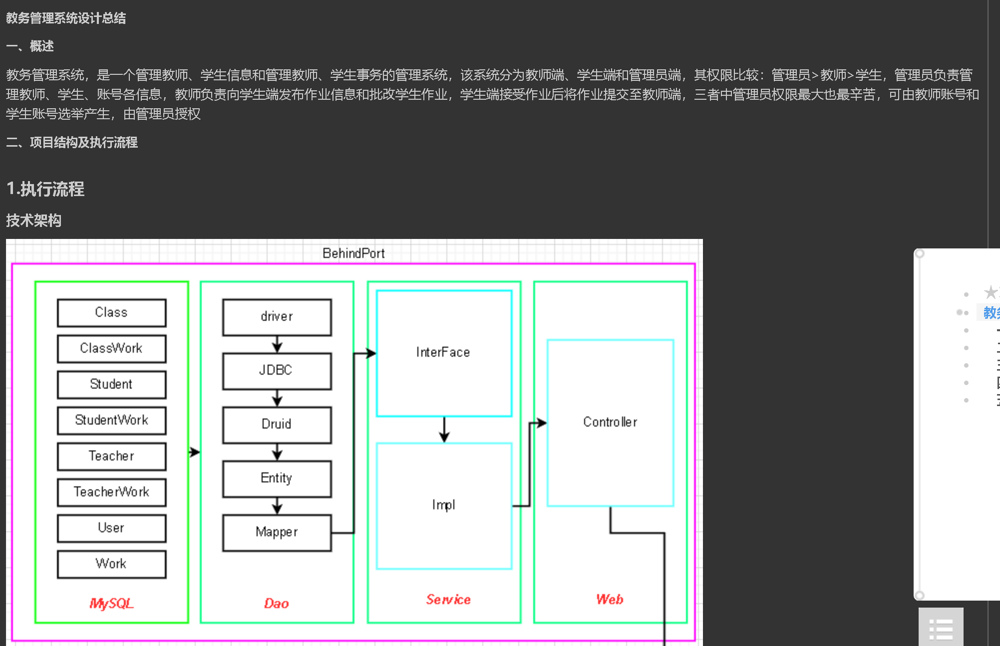

具体可参照我的博客:[教务管理系统设计总结 - 春风能解释 - 博客园 (cnblogs.com)](https://www.cnblogs.com/cfnjs/articles/15939386.html)

在经历了长期的磨练和学习以及获得一些开发小项目的经验以后，我决定了重新开发这个项目。

## 设计蓝图

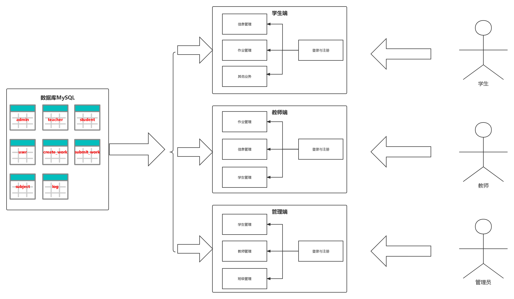

# 二、项目需求分析

项目需求整体与之前的项目保持一致

# 三、项目整体架构

## 1.整体

SpringBoot+Vue 的前后端分离架构

## 2.数据库

MySQL

## 3.后端

SpringBoot+SpringMVC+MyBatisPlus+Jwt

## 4.前端

Vue+ElementUi+Axios+Router

# 四、开发环境

jdk1.8

MySQL8.0+

Vue3.0+

# 五、项目数据层分析

## 1.改动

鉴于之前项目的经验，我将此项目的实体进行细分，主要改动如下:

1. 将所有实体添加日志监控功能，并将其存放在一个独立的表中，由此产生了新实体 日志。
   **日志(日志编号，逻辑删除，创建时间，修改时间)**

2. 新增管理员实体，用户表新增用户头像字段，**用户密码进行了加密处理**

3. 新增科目实体，将直接与教师实体关联

   **科目(科目编号，科目名)**

4. 为避免职权滥用，管理端将失去对账号信息的控制，账号信息的安全将由学生和教师自行负责

## 2.代码

数据库代码如下:

```sql
-- =================教务管理系统================= --
create database teaching_system;

use teaching_system;

-- ----------------------------------------------
-- -----------------==日志表==----------------- --
-- ----------------------------------------------
create table `log`
(
    log_id      bigint primary key auto_increment comment '日志编号',
    deleted     int      not null default 0 comment '逻辑删除',
    create_time datetime not null default CURRENT_TIMESTAMP comment '添加时间',
    update_time datetime not null default CURRENT_TIMESTAMP comment '更新时间'
);
-- ----------------------------------------------
-- -----------------==班级表==----------------- --
-- ----------------------------------------------
create table `class`
(
    class_id   bigint primary key auto_increment comment '班级编号',
    class_name varchar(32) not null comment '班级名',
    log_id     bigint      not null comment '日志编号',
    constraint cl_lg_fk foreign key (log_id) references log (log_id)
);
-- ----------------------------------------------
-- -----------------==科目表==----------------- --
-- ----------------------------------------------
create table `subject`
(
    subject_id   bigint primary key auto_increment comment '科目编号',
    subject_name varchar(32) not null comment '科目名',
    log_id       bigint      not null comment '日志编号',
    constraint su_lg_fk foreign key (log_id) references log (log_id)
);
-- ----------------------------------------------
-- -----------------==用户表==----------------- --
-- ----------------------------------------------
create table `user`
(
    user_id       bigint primary key auto_increment comment '用户编号',
    user_name     varchar(32) unique not null comment '账号',
    user_password varchar(64)        not null comment '密码',
    user_salt     varchar(64)        not null comment '盐值',
    user_header   varchar(64)        not null default 0 comment '用户头像',
    user_index    bigint             not null default 0 comment '身份编号',
    user_identity int                not null default 0 comment '身份码(0学生,1教师,2管理员)',
    log_id        bigint             not null comment '日志编号',
    constraint us_lg_fk foreign key (log_id) references log (log_id)
);
-- ----------------------------------------------
-- -----------------==教师表==----------------- --
-- ----------------------------------------------
create table `teacher`
(
    teacher_id      bigint primary key auto_increment comment '教师编号',
    teacher_name    varchar(32) not null comment '教师姓名',
    teacher_age     int         not null comment '教师年龄',
    teacher_gender  int         not null comment '教师性别(0代表女,1代表男)',
    teacher_address varchar(64) not null comment '教师住址',
    teacher_phone   varchar(16) not null comment '教师电话',
    teacher_email   varchar(32) not null comment '教师邮箱',
    subject_id      bigint      not null comment '科目编号',
    log_id          bigint      not null comment '日志编号',
    constraint te_lg_fk foreign key (log_id) references log (log_id),
    constraint te_su_fk foreign key (subject_id) references subject (subject_id)
);
-- ----------------------------------------------
-- -----------------==学生表==----------------- --
-- ----------------------------------------------
create table `student`
(
    student_id      bigint primary key auto_increment comment '学生编号',
    student_name    varchar(32) not null comment '学生姓名',
    student_age     int         not null comment '学生年龄',
    student_gender  int         not null comment '学生性别(0代表女,1代表男)',
    student_address varchar(64) not null comment '学生住址',
    student_phone   varchar(16) not null comment '学生电话',
    student_email   varchar(32) not null comment '学生邮箱',
    class_id        bigint      not null comment '班级编号',
    log_id          bigint      not null comment '日志编号',
    constraint st_lg_fk foreign key (log_id) references log (log_id),
    constraint st_cl_fk foreign key (class_id) references class (class_id)
);

-- ----------------------------------------------
-- -----------------==管理员表==--------------  --
-- ----------------------------------------------
create table `admin`
(
    admin_id      bigint primary key auto_increment comment '管理员编号',
    admin_name    varchar(32) not null comment '管理员姓名',
    admin_age     int         not null comment '管理员年龄',
    admin_gender  int         not null comment '管理员性别(0代表女,1代表男)',
    admin_address varchar(64) not null comment '管理员住址',
    admin_phone   varchar(16) not null comment '管理员电话',
    admin_email   varchar(32) not null comment '管理员邮箱',
    log_id        bigint      not null comment '日志编号',
    constraint ad_lg_fk foreign key (log_id) references log (log_id)
);
-- ----------------------------------------------
-- -----------------==作业表==----------------- --
-- ----------------------------------------------
create table `create_work`
(
    work_id      bigint primary key auto_increment comment '作业编号',
    work_name    varchar(32) not null comment '作业名',
    work_content varchar(64) not null comment '作业内容(可传输文件)',
    teacher_id   bigint      not null comment '布置老师',
    class_id     bigint      not null comment '班级编号',
    log_id       bigint      not null comment '日志编号',
    constraint wk_lg_fk foreign key (log_id) references log (log_id),
    constraint wk_cl_fk foreign key (class_id) references class (class_id),
    constraint wk_te_fk foreign key (teacher_id) references teacher (teacher_id)
);
-- ----------------------------------------------
-- -----------------==提交表==----------------- --
-- ----------------------------------------------
create table `submit_work`
(
    submit_id      bigint primary key auto_increment comment '提交编号',
    student_id     bigint      not null comment '提交学生',
    work_id        bigint      not null comment '作业编号',
    submit_content varchar(64) not null comment '提交内容(可传输文件)',
    submit_score   int         not null default 0 comment '提交分数',
    log_id         bigint      not null comment '日志编号',
    constraint suk_lg_fk foreign key (log_id) references log (log_id),
    constraint suk_crk_fk foreign key (work_id) references create_work (work_id),
    constraint suk_st_fk foreign key (student_id) references student (student_id)
);
```

## 3.表结构

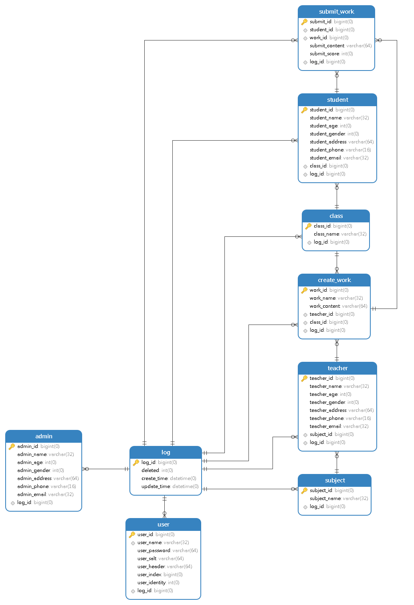

# 六、项目后端开发(大更新)

## 1.改动

项目在保留了原有的功能，增加了更多的技术点，具体改动如下:

1. 整个项目被拆分成了三个服务端，即**三个身份三个项目**

   项目结构:

   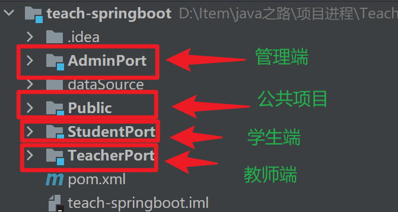

2. 业务层自定义异常处理机制，保证在不大量使用 try-catch 的情况下处理大部分异常

   ```java
   /**
    * 业务层异常超类
    */
   public class ServiceException extends RuntimeException {
       public ServiceException() {
           super();
       }

       public ServiceException(String message) {
           super(message);
       }

       public ServiceException(String message, Throwable cause) {
           super(message, cause);
       }

       public ServiceException(Throwable cause) {
           super(cause);
       }

       protected ServiceException(String message, Throwable cause, boolean enableSuppression, boolean writableStackTrace) {
           super(message, cause, enableSuppression, writableStackTrace);
       }
   }

   ```

   > ServiceException 作为业务层异常处理的超类，继承于运行时异常的超类，一切关于此项目的异常均继承于此类

   

3. 使用 java 继承机制，项目代码公共部分用一个项目独立封装，需要时取出即可

   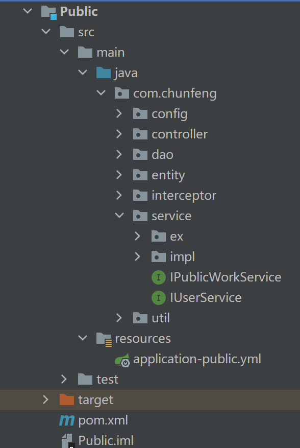

   > 如果需要引用，直接在项目 pom.xml 文件中导入公共模块即可

```xml
<dependencies>
        <dependency>
            <groupId>com.chunfeng</groupId>
            <artifactId>Public</artifactId>
        </dependency>
    </dependencies>
```

## 2.持久层具体实现

结构:


> 整体还是以实体+Mapper 为主

由于使用了 MyBatisPlus，通过继承工具类即可实现对数据库的增删改查操作。

## 3.业务层

由于项目已将三大主体身份分离，业务层的操作可能要比之前的要复杂

### (1)学生端

1. 核心业务：**上交和管理作业**

2. 具体实现

   ```java
   /**
    * 学生端业务层实现类
    */
   @Service
   @Transactional
   public class WorkServiceImpl extends ServiceImpl<SubmitWorkMapper, SubmitWork> implements IWorkService {
   
       /**
        * 提交作业持久层
        */
       @Autowired
       private SubmitWorkMapper submitWorkMapper;
   
       /**
        * 日志持久层
        */
       @Autowired
       private LogMapper logMapper;
   
       /**
        * 学生持久层
        */
       @Autowired
       private StudentMapper studentMapper;
   
       /**
        * 查询所有学生提交的作业
        *
        * @param current 页码
        * @param size    页长
        * @return JSON
        */
       @Override
       public JsonRequest<List<SubmitWork>> selectAllWork(Integer current, Integer size) {
           Page<SubmitWork> workPage = submitWorkMapper.selectPage(new Page<>(current, size), null);//获取所有作业
           if (workPage == null) {
               throw new SelectSourceIsNullException("未查询到数据!");
           }
           List<SubmitWork> works = workPage.getRecords();//获取所有作业
           for (SubmitWork work : works) {
               Log log = logMapper.selectById(work.getLogId());//拉取日志
               if (log == null) {
                   throw new LogSelectErrorException("日志拉取失败!");
               }
               work.setLog(log);//添加
           }
           return new JsonRequest<>(200, "", works, workPage.getTotal());
       }
   
       /**
        * 根据学生编号查询提交的作业
        *
        * @param current   页码
        * @param size      页长
        * @param studentId 学生编号
        * @return JSON
        */
       @Override
       public JsonRequest<List<SubmitWork>> selectWorkByStudentWork(Integer current, Integer size, Long studentId) {
           Page<SubmitWork> workPage = submitWorkMapper.selectPage(new Page<>(current, size), new QueryWrapper<SubmitWork>().eq("student_Id", studentId));//获取所有作业
           if (workPage == null) {
               throw new SelectSourceIsNullException("未查询到数据!");
           }
           List<SubmitWork> works = workPage.getRecords();//获取所有作业
           for (SubmitWork work : works) {
               Log log = logMapper.selectById(work.getLogId());//拉取日志
               if (log == null) {
                   throw new LogSelectErrorException("日志拉取失败!");
               }
               work.setLog(log);//添加
           }
           return new JsonRequest<>(200, "", works, workPage.getTotal());
       }
   
       /**
        * 提交作业
        *
        * @param submitWork 需提供:学生编号,作业编号,作业内容
        * @return JSON
        */
       @Override
       public JsonRequest<Integer> addWork(SubmitWork submitWork) {
           Log log = new Log(new SimpleDateFormat("yyyy-MM-dd HH:mm:ss").format(new Date()));//创建日志对象
           int logColumn = logMapper.insert(log);//添加日志
           if (logColumn < 1) {
               throw new LogAddErrorException("拉取日志失败!");
           }
           submitWork.setLogId(log.getLogId());//获取已添加的日志id
           int column = submitWorkMapper.insert(submitWork);
           if (column < 1) {
               throw new AddException("添加数据失败!");
           }
           return new JsonRequest<>(200, "", column, null);
       }
   
       /**
        * 修改已提交的作业
        *
        * @param submitWork 需提供:提交编号,可提供:学生编号,作业编号,作业内容
        * @return JSON
        */
       @Override
       public JsonRequest<Integer> updateWorkById(SubmitWork submitWork) {
           SubmitWork work = submitWorkMapper.selectById(submitWork.getWorkId());//判断作业信息是否存在
           if (work == null) {
               throw new SelectSourceIsNullException("该数据不存在!");
           }
           Log log = new Log(work.getLogId(), new SimpleDateFormat("yyyy-MM-dd HH:mm:ss").format(new Date()));//获取并修改时间
           int logColumn = logMapper.updateById(log);//拉取日志
           if (logColumn < 1) {
               throw new LogUpdateErrorException("拉取日志失败!");
           }
           int column = submitWorkMapper.updateById(submitWork);
           if (column < 1) {
               throw new UpdateException("修改数据失败!");
           }
           return new JsonRequest<>(200, "", column, null);
       }
   
       /**
        * 删除已提交的作业
        *
        * @param submitId 需提供:提交编号
        * @param index    操作指数(如果index值为true,则代表删除,反之代表恢复)
        * @return JSON
        */
       @Override
       public JsonRequest<Integer> deleteWorkById(Long submitId, Boolean index) {
           SubmitWork submitWork = submitWorkMapper.selectById(submitId);
           if (submitWork == null) {
               throw new SelectSourceIsNullException("该数据不存在!");
           }
           int column = logMapper.updateById(new Log(submitWork.getLogId(), index ? 1 : 0, new SimpleDateFormat("yyyy-MM-dd HH:mm:ss").format(new Date())));
           if (column < 1) {
               throw new DeleteException("删除失败!");
           }
           return new JsonRequest<>(200, "", column, null);
       }
   }
   ```

### (2)教师端

1. 核心业务：**发布和批改学生作业**

2. 具体实现：

   ```java
   /**
    * 教师端业务层实现类
    */
   @Service
   @Transactional
   public class WorkServiceImpl extends ServiceImpl<CreateWorkMapper, CreateWork> implements IWorkService {
   
       /**
        * 作业持久层
        */
       @Autowired
       private CreateWorkMapper createWorkMapper;
   
       /**
        * 日志持久层
        */
       @Autowired
       private LogMapper logMapper;
   
       /**
        * 分页查询已经布置的作业
        *
        * @param current 页码
        * @param size    页数
        * @return JSON
        */
       @Override
       public JsonRequest<List<CreateWork>> selectWork(Integer current, Integer size) {
           Page<CreateWork> workPage = createWorkMapper.selectPage(new Page<>(current, size), null);//获取所有作业
           if (workPage == null) {
               throw new SelectSourceIsNullException("未查询到数据!");
           }
           List<CreateWork> works = workPage.getRecords();//获取所有作业
           for (CreateWork work : works) {
               Log log = logMapper.selectById(work.getLogId());//拉取日志
               if (log == null) {
                   throw new LogSelectErrorException("日志拉取失败!");
               }
               work.setLog(log);//添加
           }
           return new JsonRequest<>(200, "", works, workPage.getTotal());
       }
   
       /**
        * 根据教师编号查询作业
        *
        * @param current   页码
        * @param size      每页显示数
        * @param teacherId 教师编号
        * @return JSON
        */
       @Override
       public JsonRequest<List<CreateWork>> selectAllWorkByTeacherId(Integer current, Integer size, Long teacherId) {
           Page<CreateWork> workPage = createWorkMapper.selectPage(new Page<>(current, size), new QueryWrapper<CreateWork>().eq("teacher_Id", teacherId));//获取所有作业
           if (workPage == null) {
               throw new SelectSourceIsNullException("未查询到数据!");
           }
           List<CreateWork> works = workPage.getRecords();//获取所有作业
           for (CreateWork work : works) {
               Log log = logMapper.selectById(work.getLogId());//拉取日志
               if (log == null) {
                   throw new LogSelectErrorException("日志拉取失败!");
               }
               work.setLog(log);//添加
           }
           return new JsonRequest<>(200, "", works, workPage.getTotal());
       }
   
       /**
        * 添加作业信息
        *
        * @param createWork 需提供:作业名,作业描述(可以是文件),班级编号,教师编号
        * @return JSON
        */
       @Override
       public JsonRequest<Integer> addWork(CreateWork createWork) {
           Log log = new Log(new SimpleDateFormat("yyyy-MM-dd HH:mm:ss").format(new Date()));//创建日志对象
           int logColumn = logMapper.insert(log);//添加日志
           if (logColumn < 1) {
               throw new LogAddErrorException("拉取日志失败!");
           }
           createWork.setLogId(log.getLogId());//获取已添加的日志id
           int column = createWorkMapper.insert(createWork);
           if (column < 1) {
               throw new AddException("添加数据失败!");
           }
           return new JsonRequest<>(200, "", column, null);
       }
   
       /**
        * 修改作业信息
        *
        * @param createWork 需提供:作业编号,可提供:作业名,作业描述(可以是文件),班级编号
        * @return JSON
        */
       @Override
       public JsonRequest<Integer> updateWorkById(CreateWork createWork) {
           CreateWork work = createWorkMapper.selectById(createWork.getWorkId());//判断作业信息是否存在
           if (work == null) {
               throw new SelectSourceIsNullException("该数据不存在!");
           }
           Log log = new Log(work.getLogId(), new SimpleDateFormat("yyyy-MM-dd HH:mm:ss").format(new Date()));//获取并修改时间
           int logColumn = logMapper.updateById(log);//拉取日志
           if (logColumn < 1) {
               throw new LogUpdateErrorException("拉取日志失败!");
           }
           int column = createWorkMapper.updateById(createWork);
           if (column < 1) {
               throw new UpdateException("修改数据失败!");
           }
           return new JsonRequest<>(200, "", column, null);
       }
   
       /**
        * 删除或恢复作业信息
        *
        * @param workId 作业编号
        * @param index  操作指数(如果index值为true,则代表删除,反之代表恢复)
        * @return JSON
        */
       @Override
       public JsonRequest<Integer> deleteWork(Long workId, Boolean index) {
           CreateWork createWork = createWorkMapper.selectById(workId);
           if (createWork == null) {
               throw new SelectSourceIsNullException("该数据不存在!");
           }
           int column = logMapper.updateById(new Log(createWork.getLogId(), index ? 1 : 0, new SimpleDateFormat("yyyy-MM-dd HH:mm:ss").format(new Date())));
           if (column < 1) {
               throw new DeleteException("删除失败!");
           }
           return new JsonRequest<>(200, "", column, null);
       }
   }
   ```

### (3)管理端

1. 核心业务：**管理学生，管理教师，管理管理员（不是套娃），管理科目，管理班级**

2. 具体实现：

   **学生管理**

   ```java
   /**
    * 学生管理业务层实现类
    */
   @Service
   @Transactional
   public class StudentServiceImpl extends ServiceImpl<StudentMapper, Student> implements IStudentService {
   
       /**
        * 学生持久层
        */
       @Autowired
       private StudentMapper studentMapper;
   
       /**
        * 日志持久层
        */
       @Autowired
       private LogMapper logMapper;
   
       /**
        * 查询所有学生
        *
        * @param current 页码
        * @param size    页长
        * @return JSON
        */
       @Override
       public JsonRequest<List<Student>> selectAllStudent(Integer current, Integer size) {
           Page<Student> studentPage = studentMapper.selectPage(new Page<>(current, size), null);//获取所有学生
           if (studentPage == null) {
               throw new SelectSourceIsNullException("未查询到数据!");
           }
           List<Student> studentList = studentPage.getRecords();//获取所有学生
           for (Student student : studentList) {
               Log log = logMapper.selectById(student.getLogId());//拉取日志
               if (log == null) {
                   throw new LogSelectErrorException("日志拉取失败!");
               }
               student.setLog(log);//添加
           }
           long pageSize = studentPage.getTotal();
           return new JsonRequest<>(200, "", studentList, pageSize);
       }
   
       /**
        * 按照班级编号查询学生
        *
        * @param current 页码
        * @param size    页长
        * @param classId 班级编号
        * @return JSON
        */
       @Override
       public JsonRequest<List<Student>> selectAllStudentByClassId(Integer current, Integer size, Long classId) {
           Page<Student> studentPage = studentMapper.selectPage(new Page<>(current, size), new QueryWrapper<Student>().eq("class_id", classId));//获取所有学生
           if (studentPage == null) {
               throw new SelectSourceIsNullException("未查询到数据!");
           }
           List<Student> studentList = studentPage.getRecords();//获取所有学生
           for (Student student : studentList) {
               Log log = logMapper.selectById(student.getLogId());//拉取日志
               if (log == null) {
                   throw new LogSelectErrorException("日志拉取失败!");
               }
               student.setLog(log);//添加
           }
           return new JsonRequest<>(200, "", studentList, studentPage.getTotal());
       }
   
       /**
        * 根据编号查询学生
        *
        * @param studentId 学生编号
        * @return JSON
        */
       @Override
       public JsonRequest<Student> selectAllStudentById(Long studentId) {
           Student student = studentMapper.selectById(studentId);
           if (student == null) {
               throw new SelectSourceIsNullException("未查询到数据!");
           }
           return new JsonRequest<>(200, "", student, null);
       }
   
       /**
        * 添加学生
        *
        * @param student 需提供:学生姓名,学生年龄,学生性别,学生住址,学生电话,学生邮箱,班级编号
        * @return JSON
        */
       @Override
       public JsonRequest<Integer> addStudent(Student student) {
           Log log = new Log(new SimpleDateFormat("yyyy-MM-dd HH:mm:ss").format(new Date()));//创建日志对象
           int logColumn = logMapper.insert(log);//添加日志
           if (logColumn < 1) {
               throw new LogAddErrorException("拉取日志失败!");
           }
           student.setLogId(log.getLogId());//获取已添加的日志id
           int column = studentMapper.insert(student);
           if (column < 1) {
               throw new AddException("添加数据失败!");
           }
           return new JsonRequest<>(200, "", column, null);
       }
   
       /**
        * 修改学生
        *
        * @param student 需提供:学生编号,可提供:学生姓名,学生年龄,学生性别,学生住址,学生电话,学生邮箱,班级编号
        * @return JSON
        */
       @Override
       public JsonRequest<Integer> updateStudentById(Student student) {
           Student studentSource = studentMapper.selectById(student.getStudentId());//判断学生信息是否存在
           if (studentSource == null) {
               throw new SelectSourceIsNullException("该数据不存在!");
           }
           Log log = new Log(studentSource.getLogId(), new SimpleDateFormat("yyyy-MM-dd HH:mm:ss").format(new Date()));//获取并修改时间
           int logColumn = logMapper.updateById(log);//拉取日志
           if (logColumn < 1) {
               throw new LogUpdateErrorException("拉取日志失败!");
           }
           int column = studentMapper.updateById(student);
           if (column < 1) {
               throw new UpdateException("修改数据失败!");
           }
           return new JsonRequest<>(200, "", column, null);
       }
   
       /**
        * 删除或恢复学生
        *
        * @param studentId 学生编号
        * @param index     操作指数(如果index值为true,则代表删除,反之代表恢复)
        * @return JSON
        */
       @Override
       public JsonRequest<Integer> deleteStudentById(Long studentId, Boolean index) {
           Student student = studentMapper.selectById(studentId);
           if (student == null) {
               throw new SelectSourceIsNullException("该数据不存在!");
           }
           int column = logMapper.updateById(new Log(student.getLogId(), index ? 1 : 0, new SimpleDateFormat("yyyy-MM-dd HH:mm:ss").format(new Date())));
           if (column < 1) {
               throw new DeleteException("删除失败!");
           }
           return new JsonRequest<>(200, "", column, null);
       }
   }
   ```

   **教师管理**

   ```java
   /**
    * 教师管理业务层实现类
    */
   @Service
   @Transactional
   public class TeacherServiceImpl extends ServiceImpl<TeacherMapper, Teacher> implements ITeacherService {
   
       /**
        * 教师持久层
        */
       @Autowired
       private TeacherMapper teacherMapper;
   
       /**
        * 日志持久层
        */
       @Autowired
       private LogMapper logMapper;
   
       /**
        * 查询所有教师
        *
        * @param current 页码
        * @param size    页长
        * @return JSON
        */
       @Override
       public JsonRequest<List<Teacher>> selectAllTeacher(Integer current, Integer size) {
           Page<Teacher> teacherPage = teacherMapper.selectPage(new Page<>(current, size), null);//获取所有教师
           if (teacherPage == null) {
               throw new SelectSourceIsNullException("未查询到数据!");
           }
           Long pageSize = teacherPage.getTotal();
           List<Teacher> teacherList = teacherPage.getRecords();//获取所有教师
           for (Teacher teacher : teacherList) {
               Log log = logMapper.selectById(teacher.getLogId());//拉取日志
               if (log == null) {
                   throw new LogSelectErrorException("日志拉取失败!");
               }
               teacher.setLog(log);//添加
           }
           return new JsonRequest<>(200, "", teacherList, pageSize);
       }
   
       /**
        * 按照科目编号查询教师
        *
        * @param current   页码
        * @param size      页长
        * @param subjectId 科目编号
        * @return JSON
        */
       @Override
       public JsonRequest<List<Teacher>> selectAllBySubject(Integer current, Integer size, Long subjectId) {
           Page<Teacher> teacherPage = teacherMapper.selectPage(new Page<>(current, size), new QueryWrapper<Teacher>().eq("subject_id", subjectId));//获取所有教师
           if (teacherPage == null) {
               throw new SelectSourceIsNullException("未查询到数据!");
           }
           Long pageSize = teacherPage.getTotal();
           List<Teacher> teacherList = teacherPage.getRecords();//获取所有教师
           for (Teacher teacher : teacherList) {
               Log log = logMapper.selectById(teacher.getLogId());//拉取日志
               if (log == null) {
                   throw new LogSelectErrorException("日志拉取失败!");
               }
               teacher.setLog(log);//添加
           }
           return new JsonRequest<>(200, "", teacherList, pageSize);
       }
   
       /**
        * 根据编号查询教师
        *
        * @param teacherId 教师编号
        * @return JSON
        */
       @Override
       public JsonRequest<Teacher> selectAllById(Long teacherId) {
           Teacher teacher = teacherMapper.selectById(teacherId);
           if (teacher == null) {
               throw new SelectSourceIsNullException("未查询到数据!");
           }
           return new JsonRequest<>(200, "", teacher, null);
       }
   
       /**
        * 添加教师
        *
        * @param teacher 需提供:教师姓名,教师年龄,教师性别,教师住址,教师电话,教师邮箱,科目编号
        * @return JSON
        */
       @Override
       public JsonRequest<Integer> addTeacher(Teacher teacher) {
           Log log = new Log(new SimpleDateFormat("yyyy-MM-dd HH:mm:ss").format(new Date()));//创建日志对象
           int logColumn = logMapper.insert(log);//添加日志
           if (logColumn < 1) {
               throw new LogAddErrorException("拉取日志失败!");
           }
           teacher.setLogId(log.getLogId());//获取已添加的日志id
           int column = teacherMapper.insert(teacher);
           if (column < 1) {
               throw new AddException("添加数据失败!");
           }
           return new JsonRequest<>(200, "", column, null);
       }
   
       /**
        * 修改教师
        *
        * @param teacher 需提供:教师编号,可提供:教师姓名,教师年龄,教师性别,教师住址,教师电话,教师邮箱,科目编号
        * @return JSON
        */
       @Override
       public JsonRequest<Integer> updateTeacher(Teacher teacher) {
           Teacher teacherSource = teacherMapper.selectById(teacher.getTeacherId());//判断教师信息是否存在
           if (teacherSource == null) {
               throw new SelectSourceIsNullException("该数据不存在!");
           }
           Log log = new Log(teacherSource.getLogId(), new SimpleDateFormat("yyyy-MM-dd HH:mm:ss").format(new Date()));//获取并修改时间
           int logColumn = logMapper.updateById(log);//拉取日志
           if (logColumn < 1) {
               throw new LogUpdateErrorException("拉取日志失败!");
           }
           int column = teacherMapper.updateById(teacher);
           if (column < 1) {
               throw new UpdateException("修改数据失败!");
           }
           return new JsonRequest<>(200, "", column, null);
       }
   
       /**
        * 删除或恢复教师
        *
        * @param teacherId 教师编号
        * @param index     操作指数(如果index值为true,则代表删除,反之代表恢复)
        * @return JSON
        */
       @Override
       public JsonRequest<Integer> deleteTeacher(Integer teacherId, Boolean index) {
           Teacher teacher = teacherMapper.selectById(teacherId);
           if (teacher == null) {
               throw new SelectSourceIsNullException("该数据不存在!");
           }
           int column = logMapper.updateById(new Log(teacher.getLogId(), index ? 1 : 0, new SimpleDateFormat("yyyy-MM-dd HH:mm:ss").format(new Date())));
           if (column < 1) {
               throw new DeleteException("删除失败!");
           }
           return new JsonRequest<>(200, "", column, null);
       }
   }
   ```

   **管理员管理**

   ```java
   /**
    * 管理员管理业务层实现类
    */
   @Service
   @Transactional
   public class AdminServiceImpl extends ServiceImpl<AdminMapper, Admin> implements IAdminService {
   
       /**
        * 管理员持久层
        */
       @Autowired
       private AdminMapper adminMapper;
   
       /**
        * 日志持久层
        */
       @Autowired
       private LogMapper logMapper;
   
       /**
        * 查询所有管理员
        *
        * @param current 页码
        * @param size    页长
        * @return JSON
        */
       @Override
       public JsonRequest<List<Admin>> selectAllAdmin(Integer current, Integer size) {
           Page<Admin> adminPage = adminMapper.selectPage(new Page<>(current, size), null);//获取所有管理员
           if (adminPage == null) {
               throw new SelectSourceIsNullException("未查询到数据!");
           }
           List<Admin> adminList = adminPage.getRecords();//获取所有管理员
           for (Admin admin : adminList) {
               Log log = logMapper.selectById(admin.getLogId());//拉取日志
               if (log == null) {
                   throw new LogSelectErrorException("日志拉取失败!");
               }
               admin.setLog(log);//添加
           }
           long pageSize = adminPage.getTotal();
           return new JsonRequest<>(200, "", adminList, pageSize);
       }
   
       /**
        * 按照住址编号查询管理员
        *
        * @param current      页码
        * @param size         页长
        * @param adminAddress 住址
        * @return JSON
        */
       @Override
       public JsonRequest<List<Admin>> selectAllAdminByAddress(Integer current, Integer size, String adminAddress) {
           Page<Admin> adminPage = adminMapper.selectPage(new Page<>(current, size), new QueryWrapper<Admin>().like("admin_address", adminAddress));//获取所有管理员
           if (adminPage == null) {
               throw new SelectSourceIsNullException("未查询到数据!");
           }
           List<Admin> adminList = adminPage.getRecords();//获取所有管理员
           for (Admin admin : adminList) {
               Log log = logMapper.selectById(admin.getLogId());//拉取日志
               if (log == null) {
                   throw new LogSelectErrorException("日志拉取失败!");
               }
               admin.setLog(log);//添加
           }
           return new JsonRequest<>(200, "", adminList, adminPage.getTotal());
       }
   
       /**
        * 根据编号查询管理员
        *
        * @param adminId 管理员编号
        * @return JSON
        */
       @Override
       public JsonRequest<Admin> selectAllAdminById(Long adminId) {
           Admin admin = adminMapper.selectById(adminId);
           if (admin == null) {
               throw new SelectSourceIsNullException("未查询到数据!");
           }
           return new JsonRequest<>(200, "", admin, null);
       }
   
       /**
        * 添加管理员
        *
        * @param admin 需提供:管理员姓名,管理员年龄,管理员性别,管理员住址,管理员电话,管理员邮箱
        * @return JSON
        */
       @Override
       public JsonRequest<Integer> addAdmin(Admin admin) {
           Log log = new Log(new SimpleDateFormat("yyyy-MM-dd HH:mm:ss").format(new Date()));//创建日志对象
           int logColumn = logMapper.insert(log);//添加日志
           if (logColumn < 1) {
               throw new LogAddErrorException("拉取日志失败!");
           }
           admin.setLogId(log.getLogId());//获取已添加的日志id
           int column = adminMapper.insert(admin);
           if (column < 1) {
               throw new AddException("添加数据失败!");
           }
           return new JsonRequest<>(200, "", column, null);
       }
   
       /**
        * 修改管理员
        *
        * @param admin 需提供:管理员编号,可提供:管理员姓名,管理员年龄,管理员性别,管理员住址,管理员电话,管理员邮箱
        * @return JSON
        */
       @Override
       public JsonRequest<Integer> updateAdminById(Admin admin) {
           Admin adminSource = adminMapper.selectById(admin.getAdminId());//判断管理员信息是否存在
           if (adminSource == null) {
               throw new SelectSourceIsNullException("该数据不存在!");
           }
           Log log = new Log(adminSource.getLogId(), new SimpleDateFormat("yyyy-MM-dd HH:mm:ss").format(new Date()));//获取并修改时间
           int logColumn = logMapper.updateById(log);//拉取日志
           if (logColumn < 1) {
               throw new LogUpdateErrorException("拉取日志失败!");
           }
           int column = adminMapper.updateById(admin);
           if (column < 1) {
               throw new UpdateException("修改数据失败!");
           }
           return new JsonRequest<>(200, "", column, null);
       }
   
       /**
        * 删除或恢复管理员
        *
        * @param adminId 管理员编号
        * @param index   操作指数(如果index值为true,则代表删除,反之代表恢复)
        * @return JSON
        */
       @Override
       public JsonRequest<Integer> deleteAdminById(Long adminId, Boolean index) {
           Admin admin = adminMapper.selectById(adminId);
           if (admin == null) {
               throw new SelectSourceIsNullException("该数据不存在!");
           }
           int column = logMapper.updateById(new Log(admin.getLogId(), index ? 1 : 0, new SimpleDateFormat("yyyy-MM-dd HH:mm:ss").format(new Date())));
           if (column < 1) {
               throw new DeleteException("删除失败!");
           }
           return new JsonRequest<>(200, "", column, null);
       }
   }
   ```

   **班级管理**

   ```java
   /**
    * 班级业务层实现类
    */
   @Service
   @Transactional
   public class ClassServiceImpl extends ServiceImpl<ClassMapper, Class> implements IClassService {
   
       /**
        * 班级持久层
        */
       @Autowired
       private ClassMapper classMapper;
   
       /**
        * 日志持久层
        */
       @Autowired
       private LogMapper logMapper;
   
       /**
        * 查询所有班级
        *
        * @param current 页码
        * @param size    页长
        * @return JSON
        */
       @Override
       public JsonRequest<List<Class>> selectAllClass(Integer current, Integer size) {
           Page<Class> classPage = classMapper.selectPage(new Page<>(current, size), null);//获取所有班级
           if (classPage == null) {
               throw new SelectSourceIsNullException("未查询到数据!");
           }
           Long pageSize = classPage.getTotal();
           List<Class> classList = classPage.getRecords();//获取所有班级
           for (Class aClass : classList) {
               Log log = logMapper.selectById(aClass.getLogId());//拉取日志
               if (log == null) {
                   throw new LogSelectErrorException("日志拉取失败!");
               }
               aClass.setLog(log);//添加
           }
           return new JsonRequest<>(200, "", classList, pageSize);
       }
   
       /**
        * 根据班级名查询所有班级
        *
        * @param current   页码
        * @param size      页长
        * @param className 班级名称
        * @return JSON
        */
       @Override
       public JsonRequest<List<Class>> selectAllClassLikeName(Integer current, Integer size, String className) {
           Page<Class> classPage = classMapper.selectPage(new Page<>(current, size), new QueryWrapper<Class>().like("class_name", className));
           if (classPage == null) {
               throw new SelectSourceIsNullException("未查询到数据!");
           }
           Long pageSize = classPage.getTotal();
           List<Class> classList = classPage.getRecords();//获取所有班级
           for (Class aClass : classList) {
               Log log = logMapper.selectById(aClass.getLogId());//拉取日志
               if (log == null) {
                   throw new LogSelectErrorException("日志拉取失败!");
               }
               aClass.setLog(log);//添加
           }
           return new JsonRequest<>(200, "", classList, pageSize);
       }
   
       /**
        * 根据班级编号查询班级
        *
        * @param classId 班级编号
        * @return JSON
        */
       @Override
       public JsonRequest<Class> selectALlClassById(Long classId) {
           Class aClass = classMapper.selectById(classId);
           if (aClass == null) {
               throw new SelectSourceIsNullException("未查询到数据!");
           }
           return new JsonRequest<>(200, "", aClass, null);
       }
   
       /**
        * 添加班级
        *
        * @param aClass 需提供:班级名称
        * @return JSON
        */
       @Override
       public JsonRequest<Integer> addClass(Class aClass) {
           Log log = new Log(new SimpleDateFormat("yyyy-MM-dd HH:mm:ss").format(new Date()));//创建日志对象
           int logColumn = logMapper.insert(log);//添加日志
           if (logColumn < 1) {
               throw new LogAddErrorException("拉取日志失败!");
           }
           aClass.setLogId(log.getLogId());//获取已添加的日志id
           int column = classMapper.insert(aClass);
           if (column < 1) {
               throw new AddException("添加数据失败!");
           }
           return new JsonRequest<>(200, "", column, null);
       }
   
       /**
        * 修改班级
        *
        * @param aClass 需提供:班级编号,可提供:班级名称
        * @return JSON
        */
       @Override
       public JsonRequest<Integer> updateClassById(Class aClass) {
           Class classSource = classMapper.selectById(aClass.getClassId());//判断班级信息是否存在
           if (classSource == null) {
               throw new SelectSourceIsNullException("该数据不存在!");
           }
           Log log = new Log(classSource.getLogId(), new SimpleDateFormat("yyyy-MM-dd HH:mm:ss").format(new Date()));//获取并修改时间
           int logColumn = logMapper.updateById(log);//拉取日志
           if (logColumn < 1) {
               throw new LogUpdateErrorException("拉取日志失败!");
           }
           int column = classMapper.updateById(aClass);
           if (column < 1) {
               throw new UpdateException("修改数据失败!");
           }
           return new JsonRequest<>(200, "", column, null);
       }
   
       /**
        * 删除或恢复班级
        *
        * @param classId 班级编号
        * @param index   操作指数(如果index值为true,则代表删除,反之代表恢复)
        * @return JSON
        */
       @Override
       public JsonRequest<Integer> deleteClassById(Long classId, Boolean index) {
           Class aClass = classMapper.selectById(classId);
           if (aClass == null) {
               throw new SelectSourceIsNullException("该数据不存在!");
           }
           int column = logMapper.updateById(new Log(aClass.getLogId(), index ? 1 : 0, new SimpleDateFormat("yyyy-MM-dd HH:mm:ss").format(new Date())));
           if (column < 1) {
               throw new DeleteException("删除失败!");
           }
           return new JsonRequest<>(200, "", column, null);
       }
   }
   ```

   **科目管理**

   ```java
   /**
    * 科目业务层实现类
    */
   @Service
   @Transactional
   public class SubjectServiceImpl extends ServiceImpl<SubjectMapper, Subject> implements ISubjectService {
   
       /**
        * 科目持久层
        */
       @Autowired
       private SubjectMapper subjectMapper;
   
       /**
        * 日志持久层
        */
       @Autowired
       private LogMapper logMapper;
   
       /**
        * 查询所有科目
        *
        * @param current 页码
        * @param size    页长
        * @return JSON
        */
       @Override
       public JsonRequest<List<Subject>> selectAllSubject(Integer current, Integer size) {
           Page<Subject> subjectPage = subjectMapper.selectPage(new Page<>(current, size), null);//获取所有科目
           if (subjectPage == null) {
               throw new SelectSourceIsNullException("未查询到数据!");
           }
           Long pageSize = subjectPage.getTotal();
           List<Subject> classList = subjectPage.getRecords();//获取所有科目
           for (Subject subject : classList) {
               Log log = logMapper.selectById(subject.getLogId());//拉取日志
               if (log == null) {
                   throw new LogSelectErrorException("日志拉取失败!");
               }
               subject.setLog(log);//添加
           }
           return new JsonRequest<>(200, "", classList, pageSize);
       }
   
       /**
        * 根据科目名查询
        *
        * @param current     页码
        * @param size        页长
        * @param subjectName 科目名
        * @return JSON
        */
       @Override
       public JsonRequest<List<Subject>> selectAllLikeName(Integer current, Integer size, String subjectName) {
           Page<Subject> subjectPage = subjectMapper.selectPage(new Page<>(current, size), new QueryWrapper<Subject>().like("subject_name", subjectName));
           if (subjectPage == null) {
               throw new SelectSourceIsNullException("未查询到数据!");
           }
           Long pageSize = subjectPage.getTotal();
           List<Subject> classList = subjectPage.getRecords();//获取所有科目
           for (Subject subject : classList) {
               Log log = logMapper.selectById(subject.getLogId());//拉取日志
               if (log == null) {
                   throw new LogSelectErrorException("日志拉取失败!");
               }
               subject.setLog(log);//添加
           }
           return new JsonRequest<>(200, "", classList, pageSize);
       }
   
       /**
        * 根据科目编号查询
        *
        * @param subjectId 科目编号
        * @return JSON
        */
       @Override
       public JsonRequest<Subject> selectAllById(Long subjectId) {
           Subject subject = subjectMapper.selectById(subjectId);
           if (subject == null) {
               throw new SelectSourceIsNullException("未查询到数据!");
           }
           return new JsonRequest<>(200, "", subject, null);
       }
   
       /**
        * 添加科目
        *
        * @param subject 需提供:科目名
        * @return JSON
        */
       @Override
       public JsonRequest<Integer> addSubject(Subject subject) {
           Log log = new Log(new SimpleDateFormat("yyyy-MM-dd HH:mm:ss").format(new Date()));//创建日志对象
           int logColumn = logMapper.insert(log);//添加日志
           if (logColumn < 1) {
               throw new LogAddErrorException("拉取日志失败!");
           }
           subject.setLogId(log.getLogId());//获取已添加的日志id
           int column = subjectMapper.insert(subject);
           if (column < 1) {
               throw new AddException("添加数据失败!");
           }
           return new JsonRequest<>(200, "", column, null);
       }
   
       /**
        * 修改科目
        *
        * @param subject 需提供:科目编号,可提供:科目名
        * @return JSON
        */
       @Override
       public JsonRequest<Integer> updateSubjectById(Subject subject) {
           Subject subjectSource = subjectMapper.selectById(subject.getSubjectId());//判断科目信息是否存在
           if (subjectSource == null) {
               throw new SelectSourceIsNullException("该数据不存在!");
           }
           Log log = new Log(subjectSource.getLogId(), new SimpleDateFormat("yyyy-MM-dd HH:mm:ss").format(new Date()));//获取并修改时间
           int logColumn = logMapper.updateById(log);//拉取日志
           if (logColumn < 1) {
               throw new LogUpdateErrorException("拉取日志失败!");
           }
           int column = subjectMapper.updateById(subject);
           if (column < 1) {
               throw new UpdateException("修改数据失败!");
           }
           return new JsonRequest<>(200, "", column, null);
       }
   
       /**
        * 删除或恢复科目
        *
        * @param subjectId 科目编号
        * @param index     操作指数(如果index值为true,则代表删除,反之代表恢复)
        * @return JSON
        */
       @Override
       public JsonRequest<Integer> deleteSubjectById(Long subjectId, Boolean index) {
           Subject subject = subjectMapper.selectById(subjectId);
           if (subject == null) {
               throw new SelectSourceIsNullException("该数据不存在!");
           }
           int column = logMapper.updateById(new Log(subject.getLogId(), index ? 1 : 0, new SimpleDateFormat("yyyy-MM-dd HH:mm:ss").format(new Date())));
           if (column < 1) {
               throw new DeleteException("删除失败!");
           }
           return new JsonRequest<>(200, "", column, null);
       }
   }
   ```

### (4)公共模块

公共业务层主要处理三种身份下相同的业务，如登录与注册

1. 核心业务：**账号管理，登录与注册，拦截器及异常处理，教师与学生之间相互访问，文件上传与销毁**

2. 具体实现：

   **学生与教师相互访问**

   ```java
   /**
    * 学生端与教师端公共业务层
    */
   @Service
   public class PublicWorkServiceImpl extends ServiceImpl<SubmitWorkMapper, SubmitWork> implements IPublicWorkService {
   
       /**
        * 学生持久层
        */
       @Autowired
       private StudentMapper studentMapper;
   
       /**
        * 提交作业持久层
        */
       @Autowired
       private SubmitWorkMapper submitWorkMapper;
   
       /**
        * 创建作业持久层
        */
       @Autowired
       private CreateWorkMapper createWorkMapper;
   
       /**
        * 日志持久层
        */
       @Autowired
       private LogMapper logMapper;
   
       /**
        * 班级持久层
        */
       @Autowired
       private ClassMapper classMapper;
   
       /**
        * 根据班级编号查询学生
        *
        * @param classId 班级编号
        * @return JSON
        */
       @Override
       public JsonRequest<List<Student>> selectAllStudent(Long classId) {
           List<Student> students = studentMapper.selectList(new QueryWrapper<Student>().eq("class_id", classId));
           if (students == null) {
               throw new SelectSourceIsNullException("未查询到数据!");
           }
           return new JsonRequest<>(200, "", students, (long) students.size());
       }
   
       /**
        * 教师端根据作业编号查询已提交的作业
        *
        * @param workId 作业编号
        * @return JSON
        */
       @Override
       public JsonRequest<List<SubmitWork>> selectAllSubmit(Long workId) {
           List<SubmitWork> submitWorks = submitWorkMapper.selectList(new QueryWrapper<SubmitWork>().eq("work_id", workId));
           if (submitWorks == null) {
               throw new SelectSourceIsNullException("未查询到数据!");
           }
           for (int i = 0; i < submitWorks.size(); i++) {
               submitWorks.get(i).setStudent(studentMapper.selectById(submitWorks.get(i).getStudentId()));//带入学生信息
               Log log = logMapper.selectById(submitWorks.get(i).getLogId());//拉取日志
               if (log.getDeleted() == 1) {
                   submitWorks.remove(i);
                   continue;
               }
               submitWorks.get(i).setLog(log);//添加
           }
           return new JsonRequest<>(200, "", submitWorks, (long) submitWorks.size());
       }
   
       /**
        * 教师端批改学生作业
        *
        * @param submitWork 需提供:编号,成绩
        * @return JSON
        */
       @Override
       public JsonRequest<Integer> updateAllSubmit(SubmitWork submitWork) {
           SubmitWork selectSubmitWork = submitWorkMapper.selectById(submitWork.getSubmitId());
           if (logMapper.selectById(selectSubmitWork.getLogId()).getDeleted() == 1) {//判断学生提交的作业是否已经删除
               throw new UpdateSourceIsNullException("该作业已删除!");
           }
           int column = submitWorkMapper.updateById(submitWork);
           if (column < 1) {
               throw new UpdateException("批改作业失败!");
           }
           return new JsonRequest<>(200, "", column, null);
       }
   
       /**
        * 学生端根据班级编号查询教师布置的作业
        *
        * @param classId 班级编号
        * @return JSON
        */
       @Override
       public JsonRequest<List<CreateWork>> selectAllCreate(Long classId) {
           List<CreateWork> createWorks = createWorkMapper.selectList(new QueryWrapper<CreateWork>().eq("class_id", classId));
           if (createWorks == null) {
               throw new SelectSourceIsNullException("未查询到数据!");
           }
           for (int i = 0; i < createWorks.size(); i++) {
               //拉取日志信息
               Log log = logMapper.selectById(createWorks.get(i).getLogId());
               if (log.getDeleted() == 1) {
                   createWorks.remove(i);
                   continue;
               }
               createWorks.get(i).setLog(log);
           }
           return new JsonRequest<>(200, "", createWorks, (long) createWorks.size());
       }
   
       /**
        * 教师端查询所有班级
        *
        * @return JSON
        */
       @Override
       public JsonRequest<List<Class>> selectAllClassName() {
           List<Class> classes = classMapper.selectList(null);
           if (classes == null) {
               throw new SelectSourceIsNullException("未查询到数据!");
           }
           return new JsonRequest<>(200, "", classes, (long) classes.size());
       }
   }
   ```

   **账号管理**

   ```java
   /**
    * 账号管理公共业务层实现类
    */
   @Service
   @Transactional
   public class UserServiceImpl extends ServiceImpl<UserMapper, User> implements IUserService {
   
       /**
        * 文件存放位置
        */
       @Value("${image.headerImage}")
       private String filePath;
   
       /**
        * 用户管理持久层
        */
       @Autowired
       private UserMapper userMapper;
   
       /**
        * 日志持久层
        */
       @Autowired
       private LogMapper logMapper;
   
       /**
        * 学生持久层
        */
       @Autowired
       private StudentMapper studentMapper;
   
       /**
        * 教师持久层
        */
       @Autowired
       private TeacherMapper teacherMapper;
   
       /**
        * 管理员持久层
        */
       @Autowired
       private AdminMapper adminMapper;
   
       /**
        * 文件传输业务层
        */
       @Autowired
       private IFileService fileService;
   
       /**
        * 用户登录
        *
        * @param user    用户信息:账号,密码
        * @param request 请求对象
        * @return JSON
        */
       @Override
       public JsonRequest<User> login(User user, HttpServletRequest request) {
           //根据用户名查询密码及盐值
           User userSource = userMapper.selectOne(new QueryWrapper<User>().eq("user_name", user.getUserName()));
           //如果使用用户名查不到密码和盐值或者密码与数据库中的密码不匹配,则判定用户或密码错误
           if (userSource == null || !userSource.getUserPassword().equals(getPassword(user.getUserPassword(), userSource.getUserSalt()))) {
               throw new SelectSourceIsNullException("登录失败!");
           }
           //判断日志表中的逻辑删除字段是否为1,即判断用户是否已被注销
           if (logMapper.selectById(userSource.getLogId()).getDeleted() == 1) {
               throw new SelectSourceIsDeletedException("账号信息不存在!");
           }
           switch (userSource.getUserIdentity()) {
               //如果是学生
               case 0:
                   userSource.setUser(studentMapper.selectById(userSource.getUserIndex()));
                   break;
               //如果是老师
               case 1:
                   userSource.setUser(teacherMapper.selectById(userSource.getUserIndex()));
                   break;
               //如果是管理员
               case 2:
                   userSource.setUser(adminMapper.selectById(userSource.getUserIndex()));
                   break;
           }
           User user1 = new User();
           user1.setUserIdentity(userSource.getUserIdentity());//放入用户身份信息
           user1.setToken(new JwtTokenUtil<>().createToken(userSource));//放入token
           request.getServletContext().setAttribute("user", userSource.getUserId().toString());//将用户编号放入
           return new JsonRequest<>(200, "", user1, null);
       }
   
       /**
        * 用户注册
        *
        * @param user 用户信息:账号,密码
        * @return JSON
        */
       @Override
       public JsonRequest<Integer> register(User user) {
           Log log = new Log(new SimpleDateFormat("yyyy-MM-dd hh:mm:ss").format(new Date()));//创建日志对象
           int logColumn = logMapper.insert(log);//添加日志
           if (logColumn < 1) {
               throw new LogAddErrorException("拉取日志失败!");
           }
           user.setLogId(log.getLogId());//返回日志编号
           User userSource = userMapper.selectOne(new QueryWrapper<User>().eq("user_name", user.getUserName()));
           if (userSource != null) {
               throw new AddSourceIsExistException("该用户已存在!");
           }
           String salt = UUID.randomUUID().toString().toUpperCase();//随机生成盐值
           user.setUserSalt(salt);//将盐值存放在数据库中
           user.setUserPassword(getPassword(user.getUserPassword(), salt));//加密密码
           int column = userMapper.insert(user);
           if (column < 1) {
               throw new AddException("注册失败!");
           }
           return new JsonRequest<>(200, "", column, null);
       }
   
       /**
        * 修改用户信息
        *
        * @param user 用户信息:编号,密码
        * @return JSON
        */
       @Override
       public JsonRequest<Integer> updateUser(User user) {
           User userSource = userMapper.selectById(user.getUserId());//获取用户信息
           if (userSource == null) {
               throw new SelectSourceIsNullException("该用户不存在!");
           }
           Log log = new Log(userSource.getLogId(), new SimpleDateFormat("yyyy-MM-dd hh:mm:ss").format(new Date()));//获取并修改时间
           int logColumn = logMapper.updateById(log);//拉取日志
           if (logColumn < 1) {
               throw new LogUpdateErrorException("拉取日志失败!");
           }
           String password = getPassword(user.getUserPassword(), userSource.getUserSalt());//加密用户输入的密码
           if (!password.equals(userSource.getUserPassword())) {//验证密码
               throw new SelectException("密码错误!");
           }
           if (!user.getUserPassword().equals("")) {
               user.setUserPassword(getPassword(user.getNewUserPassword(), userSource.getUserSalt()));//新密码
           }
           int column = userMapper.updateById(user);//修改
           if (column < 1) {
               throw new UpdateException("修改账号失败!");
           }
           return new JsonRequest<>(200, "", column, null);
       }
   
       /**
        * 注销
        *
        * @param userId 用户编号
        * @return JSON
        */
       @Override
       public JsonRequest<Integer> deleteUser(Long userId) {
           User user = userMapper.selectById(userId);
           if (user == null) {
               throw new SelectSourceIsNullException("用户信息不存在!");
           }
           int column = logMapper.updateById(new Log(user.getLogId(), 1, new SimpleDateFormat("yyyy-MM-dd hh:mm:ss").format(new Date())));
           if (column < 1) {
               throw new UpdateException("修改用户失败!");
           }
           return new JsonRequest<>(200, "", column, null);
       }
   
       /**
        * 根据用户编号上传头像
        *
        * @param file   头像文件
        * @param userId 用户编号
        * @return JSON
        */
       @Override
       public JsonRequest<Integer> headerUpload(MultipartFile file, Long userId) {
           User user = new User();
           user.setUserId(userId);
           User userSource = userMapper.selectById(userId);
           if (userSource == null) {
               throw new SelectSourceIsNullException("用户信息不存在!");
           }
           Log log = new Log(userSource.getLogId(), new SimpleDateFormat("yyyy-MM-dd hh:mm:ss").format(new Date()));//获取并修改时间
           int logColumn = logMapper.updateById(log);//拉取日志
           if (logColumn < 1) {
               throw new LogUpdateErrorException("拉取日志失败!");
           }
           if (!userSource.getUserHeader().equals("0")){
               File headerFile = new File(filePath + userMapper.selectById(userId).getUserHeader());
               if (!fileService.deleteFile(headerFile).getData()) {
                   throw new FileDeleteErrorException("头像删除失败!");
               }
           }
           JsonRequest<String> jsonRequest = fileService.uploadFile(file, filePath);
           //将用户头像存入数据库
           user.setUserHeader(jsonRequest.getData());
           int column = userMapper.updateById(user);
           if (column < 1) {
               throw new UpdateException("头像上传失败!");
           }
           return new JsonRequest<>(200, "", column, null);
       }
   
       /**
        * 绑定身份信息
        *
        * @param userId    用户编号
        * @param userIndex 身份编号
        * @return JSON
        */
       @Override
       public JsonRequest<Integer> BindIdentity(Long userId, Long userIndex) {
           User user = userMapper.selectById(userId);//获取用户信息
           if (user == null) {
               throw new SelectSourceIsNullException("该用户不存在!");
           }
           user.setUserIndex(userIndex);
           switch (user.getUserIdentity()) {
               case 0://学生
                   Student student = studentMapper.selectById(userIndex);
                   if (student == null) {
                       throw new SelectSourceIsNullException("没有该学生信息!");
                   }
                   break;
               case 1://教师
                   Teacher teacher = teacherMapper.selectById(userIndex);
                   if (teacher == null) {
                       throw new SelectSourceIsNullException("没有该教师信息!");
                   }
                   break;
               case 2://管理员
                   Admin admin = adminMapper.selectById(userIndex);
                   if (admin == null) {
                       throw new SelectSourceIsNullException("没有该管理员信息!");
                   }
                   break;
           }
           int column = userMapper.updateById(user);
           if (column < 1) {
               throw new UpdateException("绑定失败!");
           }
           return new JsonRequest<>(200, "", column, null);
       }
   
       /**
        * 加密密码
        *
        * @param password 原始密码
        * @param salt     盐值
        * @return 加密后的新密码
        */
       public String getPassword(String password, String salt) {
           //加密10次
           for (int i = 0; i < 10; i++) {
               //MD5加密算法
               password = DigestUtils.md5DigestAsHex((salt + password + salt).getBytes()).toUpperCase();//重组
           }
           return password;
       }
   }
   ```

   **登录拦截器**

   ```java
   /**
    * 登录拦截器
    */
   public class LoginInterceptor implements HandlerInterceptor {
   
       @Override
       public boolean preHandle(HttpServletRequest request, HttpServletResponse response, Object handler) throws Exception {
           String token = request.getHeader("token");//获取请求头的token
           String user = (String) request.getServletContext().getAttribute("user");//获取session中的用户信息
           if (token == null || user == null) {//判断token和session是否为空
               throw new TokenIsNullException("发生了未知异常!");
           }
           return user.equals(JSON.parseObject(JSON.toJSONString(new JwtTokenUtil<User>().checkToken(token)), User.class).getUserId().toString());
       }
   }
   ```

   **token 的生成与解析**

   ```java
   /**
    * jwt工具类
    */
   public class JwtTokenUtil<T> {
   
       /**
        * 过期时间
        * 设置15min过期
        */
       private final long time = 1000 * 60 * 60 * 2;
   
       /**
        * 密钥
        */
       private final String signature = "chunfeng@2516649281$";
   
       /**
        * 创建token的方法
        *
        * @param t 任意类型
        * @return token
        */
       public String createToken(T t) {
           JwtBuilder jwtBuilder = Jwts.builder();
           return jwtBuilder
                   //header
                   .setHeaderParam("typ", "JWT")
                   .setHeaderParam("alg", "HS256")
                   //payload
                   .claim("user", t)
                   .setSubject("admin-test")
                   .setExpiration(new Date(System.currentTimeMillis() + time))
                   .setId(UUID.randomUUID().toString())
                   //signature
                   .signWith(SignatureAlgorithm.HS256, signature)
                   .compact();
       }
   
       /**
        * 校验token，布尔类型
        *
        * @param token token
        * @return object
        */
       public Object checkToken(String token) {
           if (token.equals("")) {
               throw new TokenIsNullException("发生了未知异常!");
           }
           Jws<Claims> claimsJws = Jwts.parser().setSigningKey(signature).parseClaimsJws(token);
           if (claimsJws == null) {
               throw new TokenVerifyErrorException("发生了未知异常!");
           }
           return claimsJws.getBody().get("user");
       }
   }
   ```

   **文件上传与销毁**

   ```java
   /**
    * 文件上传实现类
    */
   @Service
   public class FileServiceImpl implements IFileService {
   
       /**
        * 一次上传一个文件
        *
        * @param file 文件
        * @param filePath 存放路径
        * @return JSON
        */
       @Override
       public JsonRequest<String> uploadFile(MultipartFile file, String filePath) {
           String fileName = null;
           if (examineFile(file)) {
               fileName = saveFile(file, filePath);
           }
           return new JsonRequest<>(200, "", fileName, null);
       }
   
       /**
        * 一次上传多个文件
        *
        * @param files 文件集合
        * @return JSON
        */
       @Override
       public JsonRequest<List<String>> uploadFiles(Map<MultipartFile, String> files) {
           ArrayList<String> fileNames = new ArrayList<>();
           for (Map.Entry<MultipartFile, String> entry : files.entrySet()) {
               //检查文件和路径是否存在
               if (examineFile(entry.getKey())) {
                   fileNames.add(saveFile(entry.getKey(), entry.getValue()));
               }
           }
           return new JsonRequest<>(200, "", fileNames, null);
       }
   
       /**
        * 删除单个文件
        *
        * @param file     文件
        * @return JSON
        */
       @Override
       public JsonRequest<Boolean> deleteFile(File file) {
           Boolean delete = delete(file);
           return new JsonRequest<>(200, "", delete, null);
       }
   
       /**
        * 删除多个文件
        *
        * @param files 文件和路径集合
        * @return JSON
        */
       @Override
       public JsonRequest<List<Boolean>> deleteFiles(List<File> files) {
           ArrayList<Boolean> deletes = new ArrayList<>();
           for (File file : files) {
               //检查文件是否存在
               if (file.exists()) {
                   deletes.add(delete(file));
               }
           }
           return new JsonRequest<>(200, "", deletes, null);
       }
   
       /**
        * 上传逻辑
        *
        * @param file     文件
        * @param filePath 文件存放路径
        */
       public String saveFile(MultipartFile file, String filePath) {
           //随机生成文件名
           String filename = UUID.randomUUID().toString().toUpperCase() + "." + file.getOriginalFilename().split("\\.")[1];
           //上传文件
           try {
               file.transferTo(new File(filePath + filename));
           } catch (IOException e) {
               throw new FileUploadErrorException("文件上传失败!");
           }
           return filename;
       }
   
       /**
        * 删除逻辑
        *
        * @param file     文件
        * @return JSON
        */
       public Boolean delete(File file) {
           if (file.exists()) {
               return file.delete();
           }
           return false;
       }
   
       /**
        * 检查文件是否存在及路径是否正确
        *
        * @param file 文件
        * @return Boolean
        */
       public Boolean examineFile(MultipartFile file) {
           //判断文件是否存在
           if (file.isEmpty()) {
               throw new FileIsNullException("未选择文件!");
           }
           return true;
       }
   }
   ```

## 4.控制层

控制层在原来的基础上增加异常捕获类以处理业务层抛出的异常

实现：

```java
/**
 * 全局异常处理
 */
@Controller
public class ServiceController {

    /**
     * 全局捕获异常方法
     *
     * @param e 运行时异常
     * @return JSON
     */
    @ExceptionHandler
    JsonRequest<Void> getException(Exception e) {
        JsonRequest<Void> jsonRequest = new JsonRequest<>();
        ////////////////////添加异常/////////////////////////
        //添加时数据已存在异常
        if (e instanceof AddSourceIsExistException) {
            jsonRequest.setStatue(4001);
        }//添加时日志输出异常
        else if (e instanceof LogAddErrorException) {
            jsonRequest.setStatue(4002);
        }
        ////////////////////删除异常/////////////////////////
        //删除时该数据不存在
        else if (e instanceof DeleteSourceIsNullException) {
            jsonRequest.setStatue(5001);
        }//删除时日志输出异常
        else if (e instanceof LogDeleteErrorException) {
            jsonRequest.setStatue(5002);
        }
        ////////////////////查询异常/////////////////////////
        //查询时数据为空
        else if (e instanceof SelectSourceIsNullException) {
            jsonRequest.setStatue(6001);
        }//查询时数据存在但已被删除
        else if (e instanceof SelectSourceIsDeletedException) {
            jsonRequest.setStatue(6002);
        }//查询时日志输出异常
        else if (e instanceof LogSelectErrorException) {
            jsonRequest.setStatue(6003);
        }
        ////////////////////修改异常/////////////////////////
        //修改时数据不存在
        else if (e instanceof UpdateSourceIsNullException) {
            jsonRequest.setStatue(7001);
        }//修改时日志输出异常
        else if (e instanceof LogUpdateErrorException) {
            jsonRequest.setStatue(7002);
        }
        ////////////////////token异常/////////////////////////
        //token为空
        else if (e instanceof TokenIsNullException) {
            jsonRequest.setStatue(8001);
        } //token验证失败
        else if (e instanceof TokenVerifyErrorException) {
            jsonRequest.setStatue(8002);
        }
        ////////////////////文件上传异常/////////////////////////
        //文件上传时文件为空
        else if (e instanceof FileIsNullException) {
            jsonRequest.setStatue(9001);
        }//文件上传失败
        else if (e instanceof FileUploadErrorException) {
            jsonRequest.setStatue(9002);
        }//文件路径不存在
        else if (e instanceof FilePathIsNullException) {
            jsonRequest.setStatue(9003);
        }//文件删除异常
        else if (e instanceof FileDeleteErrorException) {
            jsonRequest.setStatue(9004);
        }
        ////////////////////未知或未定义的异常/////////////////////////
        //添加数据的未知异常
        else if (e instanceof AddException) {
            jsonRequest.setStatue(4000);
        }//删除数据的未知异常
        else if (e instanceof DeleteException) {
            jsonRequest.setStatue(5000);
        }//查询数据的未知异常
        else if (e instanceof SelectException) {
            jsonRequest.setStatue(6000);
        }//修改数据的未知异常
        else if (e instanceof UpdateException) {
            jsonRequest.setStatue(7000);
        }//token的未知异常
        else if (e instanceof TokenException) {
            jsonRequest.setStatue(8000);
        }//文件操作的未知异常
        else if (e instanceof FileException) {
            jsonRequest.setStatue(9000);
        }//其他未知异常
        else {
            jsonRequest.setStatue(500);
        }
        jsonRequest.setMessage(e.getMessage());
        return jsonRequest;
    }
}
```

> 此类是控制层的超类，所有控制层的 api 均继承于该类

## 5.新功能

在之前项目的基础上，新增文件上传与加载，token 登录验证，密码加密存储等功能

### (1)文件上传与销毁功能

```java
/**
 * 文件上传实现类
 */
@Service
public class FileServiceImpl implements IFileService {

    /**
     * 一次上传一个文件
     *
     * @param file 文件
     * @param filePath 存放路径
     * @return JSON
     */
    @Override
    public JsonRequest<String> uploadFile(MultipartFile file, String filePath) {
        String fileName = null;
        if (examineFile(file)) {
            fileName = saveFile(file, filePath);
        }
        return new JsonRequest<>(200, "", fileName, null);
    }

    /**
     * 一次上传多个文件
     *
     * @param files 文件集合
     * @return JSON
     */
    @Override
    public JsonRequest<List<String>> uploadFiles(Map<MultipartFile, String> files) {
        ArrayList<String> fileNames = new ArrayList<>();
        for (Map.Entry<MultipartFile, String> entry : files.entrySet()) {
            //检查文件和路径是否存在
            if (examineFile(entry.getKey())) {
                fileNames.add(saveFile(entry.getKey(), entry.getValue()));
            }
        }
        return new JsonRequest<>(200, "", fileNames, null);
    }

    /**
     * 删除单个文件
     *
     * @param file     文件
     * @return JSON
     */
    @Override
    public JsonRequest<Boolean> deleteFile(File file) {
        Boolean delete = delete(file);
        return new JsonRequest<>(200, "", delete, null);
    }

    /**
     * 删除多个文件
     *
     * @param files 文件和路径集合
     * @return JSON
     */
    @Override
    public JsonRequest<List<Boolean>> deleteFiles(List<File> files) {
        ArrayList<Boolean> deletes = new ArrayList<>();
        for (File file : files) {
            //检查文件是否存在
            if (file.exists()) {
                deletes.add(delete(file));
            }
        }
        return new JsonRequest<>(200, "", deletes, null);
    }

    /**
     * 上传逻辑
     *
     * @param file     文件
     * @param filePath 文件存放路径
     */
    public String saveFile(MultipartFile file, String filePath) {
        //随机生成文件名
        String filename = UUID.randomUUID().toString().toUpperCase() + "." + file.getOriginalFilename().split("\\.")[1];
        //上传文件
        try {
            file.transferTo(new File(filePath + filename));
        } catch (IOException e) {
            throw new FileUploadErrorException("文件上传失败!");
        }
        return filename;
    }

    /**
     * 删除逻辑
     *
     * @param file     文件
     * @return JSON
     */
    public Boolean delete(File file) {
        if (file.exists()) {
            return file.delete();
        }
        return false;
    }

    /**
     * 检查文件是否存在及路径是否正确
     *
     * @param file 文件
     * @return Boolean
     */
    public Boolean examineFile(MultipartFile file) {
        //判断文件是否存在
        if (file.isEmpty()) {
            throw new FileIsNullException("未选择文件!");
        }
        return true;
    }
}
```

### (2)密码加密存储

```java
/**
     * 加密密码
     *
     * @param password 原始密码
     * @param salt     盐值
     * @return 加密后的新密码
     */
    public String getPassword(String password, String salt) {
        //加密10次
        for (int i = 0; i < 10; i++) {
            //MD5加密算法
            password = DigestUtils.md5DigestAsHex((salt + password + salt).getBytes()).toUpperCase();//重组
        }
        return password;
    }
```

## 6.配置文件

学生端、教师端、管理端的配置文件均继承了公共模块中的 application-public.yml 文件

### (1)学生端

```yml
#服务端口
server:
  port: 8080

#导入公共配置
spring:
  profiles:
    include: public
```

### (2)教师端

```yml
#服务端口
server:
  port: 8081

#导入公共配置
spring:
  profiles:
    include: public
```

### (3)管理端

```yml
#服务器端口
server:
  port: 8082

#导入公共配置
spring:
  profiles:
    active: public
```

### (4)公共模块

```yml
spring:
  #数据源配置
  datasource:
    driver-class-name: com.mysql.cj.jdbc.Driver
    url: jdbc:mysql://localhost:3306/teaching_system?userSSL=true&serverTimezone=GMT
    username: root
    password: 13597803422dw

#mybatisplus配置文件
mybatis-plus:
  configuration:
    log-impl: org.apache.ibatis.logging.stdout.StdOutImpl

#文件上传路径
image:
  #头像上传路径
  headerImage: D:\Item\java之路\项目进程\TeachingSystem\ItemFile\HeaderImage\
```

> 在保证项目完美运行的基础上，将三大身份的配置类提取出来，做到配置复用

# 七、项目前端开发(大更新)

## 1.学生端展示

### (1)界面展示

1. 学生端主页及公共部分展示
   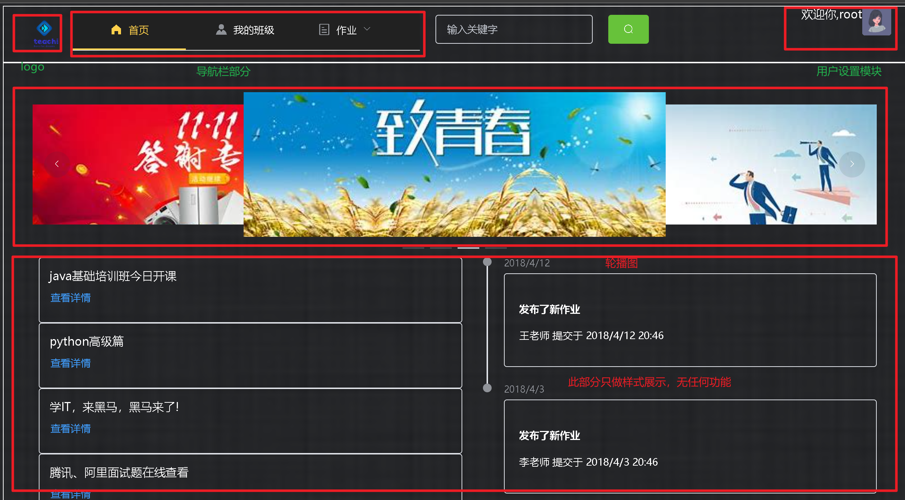

2. 所在班级查看
   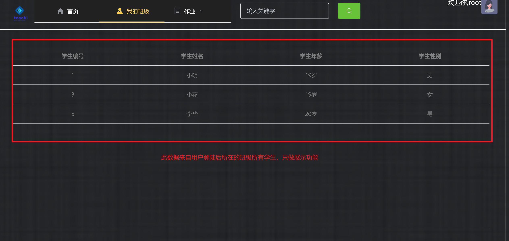

3. 管理作业
   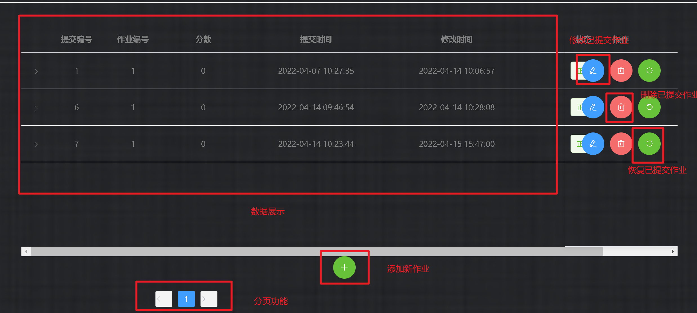

4. 查看需要完成的作业

   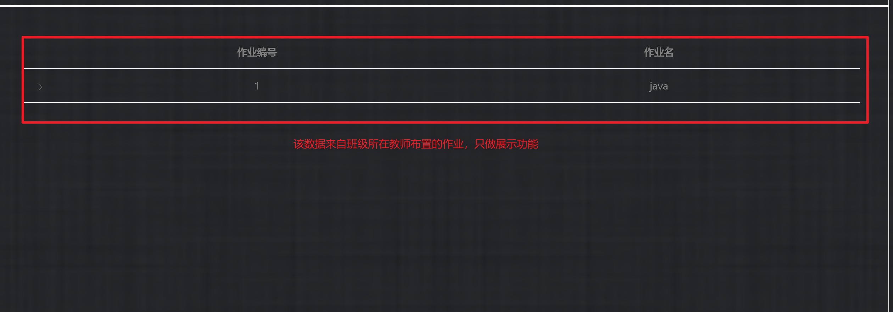

5. 用户管理模块

   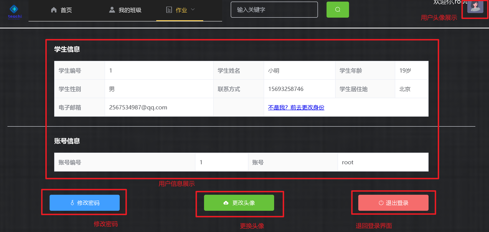

6. 登录界面展示

   

7. 注册页面展示

   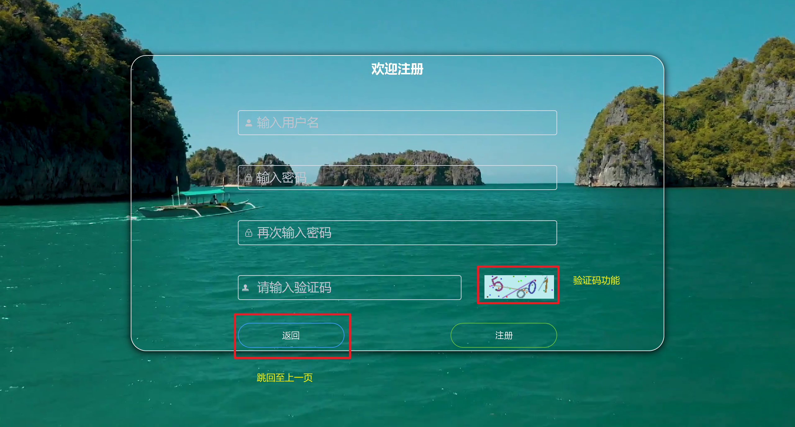

### (2)核心代码

1. 用户管理相关

```javascript
// 登录
export function login(obj) {
  return router({
    url: "/user/login",
    method: "POST",
    data: obj,
  });
}

//修改密码
export function updatePassword(obj) {
  return router({
    url: "/user",
    method: "PUT",
    data: obj,
    headers: {
      token: sessionStorage.getItem("token"),
    },
  });
}

//注册
export function register(obj) {
  return router({
    url: "/user/register",
    method: "POST",
    data: obj,
  });
}

//用户头像上传
export function headerUpload(headerFile, userId) {
  return router({
    url: `/user/${userId}`,
    method: "PUT",
    data: headerFile,
    headers: {
      token: sessionStorage.getItem("token"),
    },
  });
}

//用户身份绑定
export function bindIdentity(userId, userIndex) {
  return router({
    url: `/user/${userId}/${userIndex}`,
    method: "PUT",
    headers: {
      token: sessionStorage.getItem("token"),
    },
  });
}

//轮询函数
export function getToken() {
  return router({
    url: "/user",
    method: "GET",
    headers: {
      token: sessionStorage.getItem("token"),
    },
  });
}
```

2. 作业管理相关

```javascript
//查询所有作业
export function selectAllWork(current, size) {
  return router({
    url: `/work/${current}/${size}`,
    method: "GET",
    headers: {
      token: sessionStorage.getItem("token"),
    },
  });
}

//根据学生编号查询作业
export function selectAllWorkByStudentId(current, size, studentId) {
  return router({
    url: `/work/${current}/${size}/${studentId}`,
    method: "GET",
    headers: {
      token: sessionStorage.getItem("token"),
    },
  });
}

//提交作业
export function addWork(obj) {
  return router({
    url: "/work",
    method: "POST",
    data: obj,
    headers: {
      token: sessionStorage.getItem("token"),
    },
  });
}

//修改已提交的作业
export function updateWork(obj) {
  return router({
    url: "/work",
    method: "PUT",
    data: obj,
    headers: {
      token: sessionStorage.getItem("token"),
    },
  });
}

//删除已提交的作业
export function deleteWork(submitId, index) {
  return router({
    url: `/work/${submitId}/${index}`,
    method: "DELETE",
    headers: {
      token: sessionStorage.getItem("token"),
    },
  });
}

//查询学生
export function selectAllStudentByClassId(classId) {
  return router({
    url: `/work/${classId}?student`,
    method: "GET",
    headers: {
      token: sessionStorage.getItem("token"),
    },
  });
}

//查询所有教师已布置的作业
export function selectAllCreateWork(classId) {
  return router({
    url: `/work/${classId}?work`,
    method: "GET",
    headers: {
      token: sessionStorage.getItem("token"),
    },
  });
}
```

3. 功能代码

   > 登录部分

   ```javascript
   import { login } from "../api/user";
   import SIdentify from "../components/identify";
   export default {
   data() {
    return {
      loginForm: {
        userName: "",
        userPassword: "",
        code: "",
      },
      loginData: {
        statue: "",
        data: {
          user: {
            studentId: "",
            studentName: "",
            studentAge: "",
            studentGender: "",
            studentAddress: "",
            studentPhone: "",
            studentEmail: "",
          },
        },
        message: "",
      },
      rules: {
        userName: [
          { required: true, message: "账号不得为空!", trigger: "blur" >},
        ],
        userPassword: [
          { required: true, message: "密码不得为空!", trigger: "blur" >},
        ],
        code: [
          { required: true, message: "验证码不得为空!", trigger: "blur" >},
        ],
      },
      //随机数仓库
      identifyCodes: [1, 2, 3, 4, 5, 6, 7, 8, 9, 0],
      //验证码
      identifyCode: "",
    };
   },
   created() {
    this.refreshCode();
   },
   components: {
    SIdentify: SIdentify,
   },
   methods: {
    //   登录
    login(obj) {
      if (obj.code === "") {
        this.$message({
          type: "warning",
          message: "验证码不得为空!",
          showClose: true,
        });
        this.refreshCode();
        return;
      }
      if (obj.code != this.identifyCode) {
        this.$message({
          type: "warning",
          message: "验证码错误!",
          showClose: true,
        });
        this.refreshCode();
        return;
      }
      if (obj.userName === "" || obj.userPassword === "") {
        this.$message({
          type: "warning",
          message: "账号和密码不得为空!",
          showClose: true,
        });
        this.refreshCode();
        return;
      }
      login(obj).then((req) => {
        this.loginData = req.data;
        if (
          (this.loginData.statue == 200) &
          (this.loginData.data != null)
        ) {
          if (req.data.data.userIdentity === 0) {
            this.$message({
              type: "success",
              message: "登录成功!",
              showClose: true,
            });
            sessionStorage.setItem("token", > this.loginData.data.token);
            this.$router.push({
              name: "public",
              showClose: true,
            });
          } else {
            this.$message({
              type: "warning",
              message: "当前账号不是学生身份，请使用学生账号登录!",
              showClose: true,
            });
          }
        } else {
          this.$message({
            type: "error",
            message: this.loginData.message,
            showClose: true,
          });
        }
      });
    },
   
    //回主页
    toIndex() {
      this.$router.push({
        name: "index",
      });
    },
    //注册
    toRegister() {
      this.$router.push({
        name: "register",
      });
    },
    randomNum(min, max) {
      return Math.floor(Math.random() * (max - min) + min);
    },
    refreshCode() {
      this.identifyCode = "";
      this.makeCode(this.identifyCodes, 4);
    },
    makeCode(o, l) {
      for (let i = 0; i < l; i++) {
        this.identifyCode +=
          this.identifyCodes[this.randomNum(0, > > this.identifyCodes.length)];
      }
    },
   },
   };
   ```

   > 注册部分

   ```javascript
   import { register } from "../api/user";
   import SIdentify from "../components/identify";
   export default {
   data() {
    return {
      //注册
      registerFrom: {
        userName: "",
        userPassword: "",
        againPassword: "",
        code: "",
      },
      rules: {
        userName: [
          { required: true, message: "账号不得为空!", trigger: "blur" > },
        ],
        userPassword: [
          { required: true, message: "密码不得为空!", trigger: "blur" > },
        ],
        againPassword: [
          { required: true, message: "请确认密码!", trigger: "blur" },
        ],
        code: [
          { required: true, message: "验证码不得为空!", trigger: "blur" > },
        ],
      },
      //随机数仓库
      identifyCodes: [1, 2, 3, 4, 5, 6, 7, 8, 9, 0],
      //验证码
      identifyCode: "",
    };
   },
   components: {
    SIdentify: SIdentify,
   },
   mounted() {
    this.identifyCode = "";
    this.makeCode(this.identifyCodes, 4);
   },
   created() {},
   methods: {
    //返回
    exit() {
      this.$router.go(-1);
    },
    //注册
    register(obj) {
      if (obj.code === "") {
        this.$message({
          type: "warning",
          message: "验证码不能为空!",
        });
        this.refreshCode();
        return;
      }
      if (obj.userName === "" || obj.userPassword === "") {
        this.$message({
          type: "warning",
          message: "用户名和密码不能为空!",
        });
        this.refreshCode();
        return;
      }
      if (obj.code != this.identifyCode) {
        this.$message({
          type: "warning",
          message: "验证码错误!",
        });
        this.refreshCode();
        return;
      }
      if (obj.userPassword != obj.againPassword) {
        this.$message({
          type: "warning",
          message: "两次输入的密码不一致!",
        });
        return;
      }
      register(obj).then((req) => {
        if ((req.data.statue === 200) & (req.data.data != null)) {
          this.$message({
            type: "success",
            message: "注册成功!请登录",
            showClose: true,
          });
          this.$router.push({
            name: "login",
          });
        } else {
          this.$message({
            type: "error",
            message: "注册失败!" + req.data.message,
            showClose: true,
          });
        }
      });
    },
    randomNum(min, max) {
      return Math.floor(Math.random() * (max - min) + min);
    },
    refreshCode() {
      this.identifyCode = "";
      this.makeCode(this.identifyCodes, 4);
    },
    makeCode(o, l) {
      for (let i = 0; i < l; i++) {
        this.identifyCode +=
          this.identifyCodes[this.randomNum(0, >this.identifyCodes.length)];
      }
    },
   },
   };
   ```

   > 作业管理部分

```javascript
import jwtDecode from "jwt-decode";
import {
selectAllWorkByStudentId,
addWork,
updateWork,
deleteWork,
} from "../api/work";
export default {
data() {
 return {
   //表格数据
   tableData: [],
   //页码
   current: 1,
   //页长
   size: 10,
   //分页大小
   pageSize: "",
   //编辑框
   editdialogFormVisible: false,
   //添加框
   adddialogFormVisible: false,
   //编辑数据
   editFrom: {
     //提交编号
     submitId: "",
     //作业编号
     workId: "",
     //作业内容
     submitContent: "",
   },
   //添加数据
   addFrom: {
     //学生编号
     studentId: "",
     //作业编号
     workId: "",
     //提交的作业
     submitContent: "",
   },
   rules: {
     workId: [
       { required: true, message: "请输入作业编号", trigger: "blur" },
     ],
     submitContent: [
       {
         required: true,
         message: "请输入你要提交的作业",
         trigger: "blur",
       },
     ],
   },
 };
},
created() {
 this.addFrom.studentId = jwtDecode(
   sessionStorage.getItem("token")
 ).user.user.studentId;
 this.selectAllWorkByStudentId(
   this.current,
   this.size,
   this.addFrom.studentId
 );
 this.mounted();
},
methods: {
 //查询所有已完成的作业
 selectAllWorkByStudentId(current, size, studentId) {
   selectAllWorkByStudentId(current, size, studentId).then((req) => >{
     this.tableData = req.data.data;
     this.pageSize = req.data.pageSize;
   });
 },
 //添加作业
 addWork(Source) {
   if (Source.workId === "" || Source.submitContent === "") {
     this.$message({
       showClose: true,
       type: "warning",
       message: "请输入完整的作业信息",
     });
     return;
   }
   addWork(Source).then((req) => {
     if ((req.data.statue === 200) & (req.data.data != null)) {
       this.$message({
         showClose: true,
         type: "success",
         message: "添加成功",
       });
       this.selectAllWorkByStudentId(
         this.current,
         this.size,
         this.addFrom.studentId
       );
       this.adddialogFormVisible = false;
     } else {
       this.$message({
         type: "error",
         showClose: true,
         message: "添加失败!",
       });
     }
   });
 },
 // 修改作业
 updateWork(Source) {
   if (Source.workId === "" || Source.submitContent === "") {
     this.$message({
       showClose: true,
       type: "warning",
       message: "请输入完整的作业信息",
     });
     return;
   }
   updateWork(Source).then((req) => {
     if ((req.data.statue === 200) & (req.data.data != null)) {
       this.$message({
         showClose: true,
         type: "success",
         message: "修改成功",
       });
       this.selectAllWorkByStudentId(
         this.current,
         this.size,
         jwtDecode(sessionStorage.getItem("token")).user.user.studentId
       );
       this.editdialogFormVisible = false;
     } else {
       this.$message({
         showClose: true,
         type: "error",
         message: "修改失败!",
       });
     }
   });
 },
 // 删除作业
 deleteWork(submitId, index) {
   this.$confirm(
     index
       ? "此操作将删除该作业, 是否继续?"
       : "此操作将恢复该作业, 是否继续?",
     "提示",
     {
       confirmButtonText: "确定",
       cancelButtonText: "取消",
       type: "warning",
     }
   ).then(() => {
     deleteWork(submitId, index).then((req) => {
       if ((req.data.statue === 200) & (req.data.data != null)) {
         this.$message({
           showClose: true,
           type: "success",
           message: "操作成功",
         });
         this.selectAllWorkByStudentId(
           this.current,
           this.size,
           jwtDecode(sessionStorage.getItem("token")).user.user.studentId
         );
       } else {
         this.$message({
           showClose: true,
           type: "error",
           message: "操作失败!",
         });
       }
     });
   });
 },
 editClick(Source) {
   this.editFrom = Source;
   this.editdialogFormVisible = true;
 },
 // 分页
 handleCurrentChange(val) {
   this.current = val;
   this.selectAllWorkByStudentId(
     this.current,
     this.size,
     this.addFrom.studentId
   );
 },
 mounted() {
   setInterval(() => {
     document
       .getElementById("table")
       .classList.remove >("el-table--enable-row-hover");
   });
 },
},
};
```

> 用户管理部分

```javascript
import { getURL } from "../util/index";
import myUpload from "vue-image-crop-upload";
import { updatePassword } from "../api/user";
import jwtDecode from "jwt-decode";
export default {
  components: { myUpload },
  data() {
    return {
      // 用户信息
      userFrom: {},
      //   修改登录
      loginDialogFormVisible: false,
      //   修改密码的表单数据
      updatePasswordFrom: {
        userId: "",
        userPassword: "",
        newUserName: "",
        newUserPassword: "",
        againUserPassword: "",
        newUserHeader: "",
      },
      rules: {
        userPassword: [
          { required: true, message: "密码不得为空!", trigger: "blur" },
        ],
        newUserPassword: [
          { required: true, message: "请输入新密码", trigger: "blur" },
        ],
        againUserPassword: [
          { required: true, message: "请再次输入密码", trigger: "blur" },
        ],
      },
      //访问路径
      url: "",
      //显示上传图片窗口
      showDialog: false,
      Headers: { token: sessionStorage.getItem("token") },
    };
  },
  created() {
    this.url = getURL();
    this.userFrom = jwtDecode(sessionStorage.getItem("token")).user;
  },
  methods: {
    // 退出操作
    exitLogin() {
      this.$confirm("是否退出?", "退出登录", {
        confirmButtonText: "确定",
        cancelButtonText: "取消",
        type: "warning",
      }).then(() => {
        this.$router.push({
          name: "login",
        });
        sessionStorage.clear();
        this.$message({
          showClose: true,
          type: "success",
          message: "登出成功!",
        });
      });
    },

    // 修改密码
    updatePassword(obj) {
      obj.userId = this.userFrom.userId;
      if (obj.userPassword === "") {
        this.$message({
          type: "warning",
          message: "密码不得为空!",
          showClose: true,
        });
        return;
      }
      if (obj.newUserPassword != obj.againUserPassword) {
        this.$message({
          type: "warning",
          message: "两次输入的密码不一致!",
          showClose: true,
        });
        return;
      }
      updatePassword(obj).then((req) => {
        if ((req.data.statue == 200) & (req.data.data > 0)) {
          this.loginDialogFormVisible = false;
          this.$message({
            type: "success",
            message: "修改账号成功!请重新登录!",
            showClose: true,
          });
          this.$router.push({
            name: "login",
          });
          sessionStorage.clear();
        } else {
          this.$message({
            type: "error",
            message: "修改失败!",
            showClose: true,
          });
        }
      });
    },
    // 点击头像打开上传窗口
    toggleShow() {
      this.showDialog = !this.showDialog;
    },
    // 上传成功后重新载入信息
    cropUploadSuccess(jsonData) {
      if ((jsonData.statue === 200) & (jsonData.data != null)) {
        this.$notify({
          title: "提示",
          message: "更换头像成功!下次登录时生效!",
          type: "warning",
        });
      } else {
        this.$notify({
          title: "提示",
          message: "更换头像失败!",
          type: "warning",
        });
      }
    },
  },
};
```

## 2.教师端展示

### (1)界面展示

1. 整体页面展示

   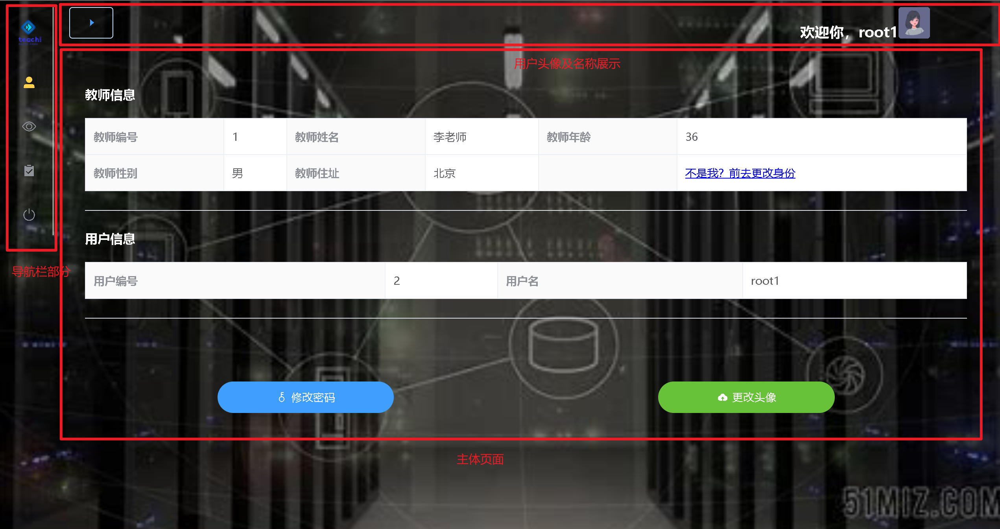

2. 个人用户信息展示

   

3. 检查作业页面展示

   

   

4. 上传作业页面展示

   

5. 登录页面展示

   

6. 注册页面展示

   

### (2)核心代码

> 1. 登录及注册逻辑与学生端相同

```javascript
import { login } from "../api/user";
import SIdentify from "../components/identify";
export default {
  data() {
    return {
      //表单数据
      dataFrom: {},
      //登录表单
      loginFrom: {
        //用户名
        userName: "",
        //用户密码
        userPassword: "",
        //验证码
        code: "",
      },
      //随机数仓库
      identifyCodes: [1, 2, 3, 4, 5, 6, 7, 8, 9, 0],
      //验证码
      identifyCode: "",
      //表单验证
      rules: {
        userName: [
          { required: true, message: "用户名不得为空!", trigger: "blur" },
        ],
        userPassword: [
          { required: true, message: "密码不得为空!", trigger: "blur" },
        ],
        againPassword: [
          { required: true, message: "请再次输入密码!", trigger: "blur" },
        ],
        userName: [
          { required: true, message: "用户名不得为空!", trigger: "blur" },
        ],
        code: [{ required: true, message: "验证码不得为空!", trigger: "blur" }],
      },
    };
  },
  created() {
    this.refreshCode();
  },
  components: {
    SIdentify: SIdentify,
  },
  methods: {
    //跳转到注册页面
    getRegister() {
      this.$router.push({ name: "register" });
    },
    //登录逻辑
    login(obj) {
      if (obj.code === "") {
        this.$message({
          type: "warning",
          message: "验证码不得为空!",
          showClose: true,
        });
        this.refreshCode();
        return;
      }
      if (obj.code != this.identifyCode) {
        this.$message({
          type: "error",
          message: "验证码不正确!",
          showClose: true,
        });
        this.refreshCode();
        return;
      }
      if (obj.userName === "" || obj.userPassword === "") {
        this.$message({
          type: "warning",
          message: "账号或密码不得为空!",
          showClose: true,
        });
        this.refreshCode();
        return;
      }
      login(obj).then((req) => {
        if ((req.data.statue === 200) & (req.data.data != null)) {
          if (req.data.data.userIdentity === 1) {
            this.$message({
              type: "success",
              message: "登录成功!",
              showClose: true,
            });
            sessionStorage.setItem("token", req.data.data.token);
            this.$router.push({ name: "public" });
          } else {
            this.$message({
              type: "warning",
              message: "当前账号不是教师身份，请使用教师账号登录!",
              showClose: true,
            });
            this.refreshCode();
          }
        } else {
          this.$message({
            type: "error",
            message: req.data.message,
            showClose: true,
          });
          this.refreshCode();
        }
      });
    },
    randomNum(min, max) {
      return Math.floor(Math.random() * (max - min) + min);
    },
    refreshCode() {
      this.identifyCode = "";
      this.makeCode(this.identifyCodes, 4);
    },
    makeCode(o, l) {
      for (let i = 0; i < l; i++) {
        this.identifyCode +=
          this.identifyCodes[this.randomNum(0, this.identifyCodes.length)];
      }
    },
  },
};
```

> 2. 教师端后台接口 api 代码

```javascript
import router from "../util/index";

//查询所有已布置的作业
export function selectAllWork(current, size) {
  return router({
    url: `/work/${current}/${size}`,
    method: "GET",
    headers: {
      token: sessionStorage.getItem("token"),
    },
  });
}

//根据教师编号查询作业
export function selectAllWorkByTeacherId(current, size, teacherId) >{
  return router({
    url: `/work/${current}/${size}/${teacherId}`,
    method: "GET",
    headers: {
      token: sessionStorage.getItem("token"),
    },
  });
}

//添加作业
export function addWork(obj) {
  return router({
    url: "/work",
    method: "POST",
    data: obj,
    headers: {
      token: sessionStorage.getItem("token"),
    },
  });
}

//修改作业
export function updateWorkById(obj) {
  return router({
    url: "/work",
    method: "PUT",
    data: obj,
    headers: {
      token: sessionStorage.getItem("token"),
    },
  });
}

//删除作业:操作指数(true代表查询未删除的数据,false代表查询已删除的数据)
export function deleteWork(workId, index) {
  return router({
    url: `/work/${workId}/${index}`,
    method: "DELETE",
    headers: {
      token: sessionStorage.getItem("token"),
    },
  });
}

//根据班级查询学生
export function selectAllStudent(classId) {
  return router({
    url: `/work/${classId}?student`,
    method: "GET",
    headers: {
      token: sessionStorage.getItem("token"),
    },
  });
}

//根据作业编号查询学生作业完成情况
export function selectAllSubmit(workId) {
  return router({
    url: `/work/${workId}?sw`,
    method: "GET",
    headers: {
      token: sessionStorage.getItem("token"),
    },
  });
}

//根据班级编号查询教师已布置的作业
export function selectAllWorkByClassId(classId) {
  return router({
    url: `/work${classId}?work`,
    method: "GET",
    headers: {
      token: sessionStorage.getItem("token"),
    },
  });
}

//批改学生作业
export function updateSubmit(obj) {
  return router({
    url: `/work/sc`,
    method: "PUT",
    data: obj,
    headers: {
      token: sessionStorage.getItem("token"),
    },
  });
}

//查询所有班级
export function selectAllClass() {
  return router({
    url: "/work?class",
    method: "GET",
    headers: {
      token: sessionStorage.getItem("token"),
    },
  });
}
```

## 3.管理端展示

### (1)界面展示

1. 整体页面展示

   

2. 个人设置页面

   

3. 学生、教师、管理员管理页面

   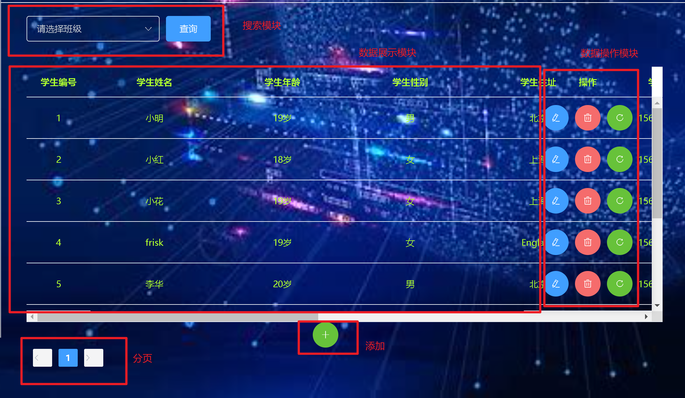

4. 班级、科目展示页面

   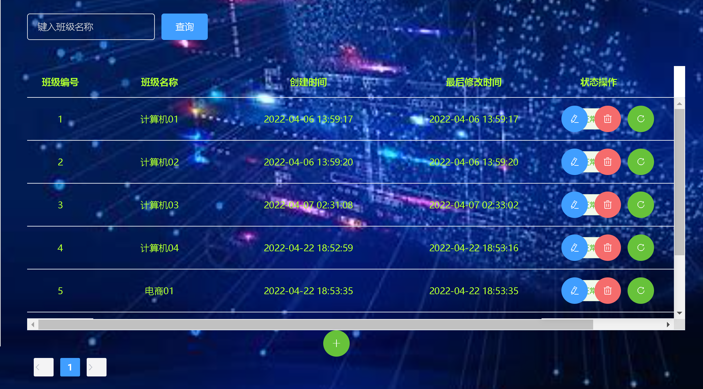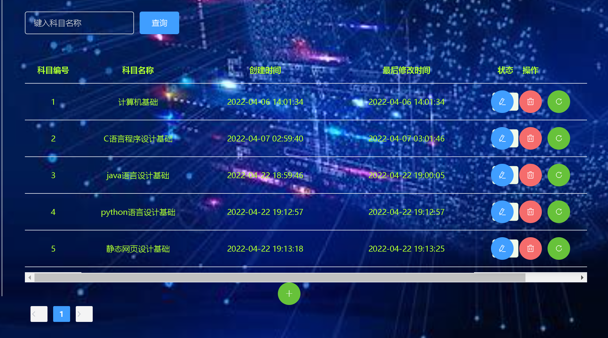

5. 登录、注册页面展示

   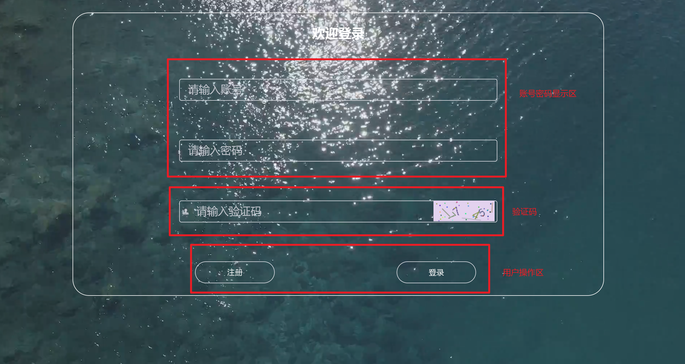

   

### (2)核心代码

> 1. 管理员操作接口

```javascript
import router from "../util/index";

//分宜查询所有管理员
export function selectAllAdmin(current, size) {
  return router({
    url: `/admin/${current}/${size}`,
    method: "GET",
    headers: {
      token: sessionStorage.getItem("token"),
    },
  });
}

//根据地址名称查询管理员
export function selectAllAdminByAddress(current, size, >adminAddress) {
  return router({
    url: `/admin/${current}/${size}/${adminAddress}`,
    method: "GET",
    headers: {
      token: sessionStorage.getItem("token"),
    },
  });
}

//根据管理员编号查询管理员
export function selectAllAdminById(AdminId) {
  return router({
    url: `/admin/${AdminId}`,
    method: "GET",
    headers: {
      token: sessionStorage.getItem("token"),
    },
  });
}

//添加管理员
export function addAdmin(obj) {
  return router({
    url: `/admin`,
    method: "POST",
    data: obj,
    headers: {
      token: sessionStorage.getItem("token"),
    },
  });
}

//根据管理员编号修改管理员
export function updateAdminById(obj) {
  return router({
    url: `/admin`,
    method: "PUT",
    data: obj,
    headers: {
      token: sessionStorage.getItem("token"),
    },
  });
}

//根据管理员编号删除管理员(index值为true,则代表删除,反之代表恢复)
export function deleteAdminById(AdminId, index) {
  return router({
    url: `/admin/${AdminId}/${index}`,
    method: "DELETE",
    headers: {
      token: sessionStorage.getItem("token"),
    },
  });
}
```

> 2. 教师管理操作接口

```javascript
import router from "../util/index";

//分宜查询所有教师
export function selectAllTeacher(current, size) {
  return router({
    url: `/teacher/${current}/${size}`,
    method: "GET",
    headers: {
      token: sessionStorage.getItem("token"),
    },
  });
}

//根据科目编号查询教师
export function selectAllTeacherBySubject(current, size, subjectId) >{
  return router({
    url: `/teacher/${current}/${size}/${subjectId}`,
    method: "GET",
    headers: {
      token: sessionStorage.getItem("token"),
    },
  });
}

//根据教师编号查询教师
export function selectAllTeacherById(teacherId) {
  return router({
    url: `/teacher/${teacherId}`,
    method: "GET",
    headers: {
      token: sessionStorage.getItem("token"),
    },
  });
}

//添加教师
export function addTeacher(obj) {
  return router({
    url: `/teacher`,
    method: "POST",
    data: obj,
    headers: {
      token: sessionStorage.getItem("token"),
    },
  });
}

//根据教师编号修改教师
export function updateTeacherById(obj) {
  return router({
    url: `/teacher`,
    method: "PUT",
    data: obj,
    headers: {
      token: sessionStorage.getItem("token"),
    },
  });
}

//根据教师编号删除教师(index值为true,则代表删除,反之代表恢复)
export function deleteTeacherById(teacherId, index) {
  return router({
    url: `/teacher/${teacherId}/${index}`,
    method: "DELETE",
    headers: {
      token: sessionStorage.getItem("token"),
    },
  });
}
```

> 3. 学生管理操作接口

```javascript
import router from "../util/index";

//分宜查询所有学生
export function selectAllStudent(current, size) {
  return router({
    url: `/student/${current}/${size}`,
    method: "GET",
    headers: {
      token: sessionStorage.getItem("token"),
    },
  });
}

//根据班级名称查询学生
export function selectAllStudentByClass(current, size, className) {
  return router({
    url: `/student/${current}/${size}/${className}`,
    method: "GET",
    headers: {
      token: sessionStorage.getItem("token"),
    },
  });
}

//根据学生编号查询学生
export function selectAllStudentById(studentId) {
  return router({
    url: `/student/${studentId}`,
    method: "GET",
    headers: {
      token: sessionStorage.getItem("token"),
    },
  });
}

//添加学生
export function addStudent(obj) {
  return router({
    url: `/student`,
    method: "POST",
    data: obj,
    headers: {
      token: sessionStorage.getItem("token"),
    },
  });
}

//根据学生编号修改学生
export function updateStudentById(obj) {
  return router({
    url: `/student`,
    method: "PUT",
    data: obj,
    headers: {
      token: sessionStorage.getItem("token"),
    },
  });
}

//根据学生编号删除学生(index值为true,则代表删除,反之代表恢复)
export function deleteStudentById(studentId, index) {
  return router({
    url: `/student/${studentId}/${index}`,
    method: "DELETE",
    headers: {
      token: sessionStorage.getItem("token"),
    },
  });
}
```

> 4. 班级管理操作接口

```javascript
import router from "../util/index";

//分宜查询所有班级
export function selectAllClass(current, size) {
  return router({
    url: `/class/${current}/${size}`,
    method: "GET",
    headers: {
      token: sessionStorage.getItem("token"),
    },
  });
}

//根据名称查询班级
export function selectAllClassByName(current, size, className) {
  return router({
    url: `/class/${current}/${size}/${className}`,
    method: "GET",
    headers: {
      token: sessionStorage.getItem("token"),
    },
  });
}

//根据编号查询班级
export function selectAllClassById(classId) {
  return router({
    url: `/class/${classId}`,
    method: "GET",
    headers: {
      token: sessionStorage.getItem("token"),
    },
  });
}

//添加班级
export function addClass(obj) {
  return router({
    url: `/class`,
    method: "POST",
    data: obj,
    headers: {
      token: sessionStorage.getItem("token"),
    },
  });
}

//根据编号修改班级
export function updateClassById(obj) {
  return router({
    url: `/class`,
    method: "PUT",
    data: obj,
    headers: {
      token: sessionStorage.getItem("token"),
    },
  });
}

//根据班级编号删除班级(index值为true,则代表删除,反之代表恢复)
export function deleteClassById(classId, index) {
  return router({
    url: `/class/${classId}/${index}`,
    method: "DELETE",
    headers: {
      token: sessionStorage.getItem("token"),
    },
  });
}
```

> 5. 科目管理操作接口

```javascript
import router from "../util/index";

//分宜查询所有科目
export function selectAllSubject(current, size) {
  return router({
    url: `/subject/${current}/${size}`,
    method: "GET",
    headers: {
      token: sessionStorage.getItem("token"),
    },
  });
}

//根据名称查询科目
export function selectAllSubjectByName(current, size, subjectName) {
  return router({
    url: `/subject/${current}/${size}/${subjectName}`,
    method: "GET",
    headers: {
      token: sessionStorage.getItem("token"),
    },
  });
}

//根据编号查询科目
export function selectAllSubjectById(subjectId) {
  return router({
    url: `/subject/${subjectId}`,
    method: "GET",
    headers: {
      token: sessionStorage.getItem("token"),
    },
  });
}

//添加科目
export function addSubject(obj) {
  return router({
    url: `/subject`,
    method: "POST",
    data: obj,
    headers: {
      token: sessionStorage.getItem("token"),
    },
  });
}

//根据编号修改科目
export function updateSubjectById(obj) {
  return router({
    url: `/subject`,
    method: "PUT",
    data: obj,
    headers: {
      token: sessionStorage.getItem("token"),
    },
  });
}

//根据科目编号删除科目(index值为true,则代表删除,反之代表恢复)
export function deleteSubjectById(subjectId, index) {
  return router({
    url: `/subject/${subjectId}/${index}`,
    method: "DELETE",
    headers: {
      token: sessionStorage.getItem("token"),
    },
  });
}
```

# 八、项目使用注意事项

## 1.项目头像功能注意事项

启用项目时需要需要手动配置项目头像存储路径，具体实现如下：

~~(1)后端只需更改 Public 模块下的 application-public.yml 文件即可~~

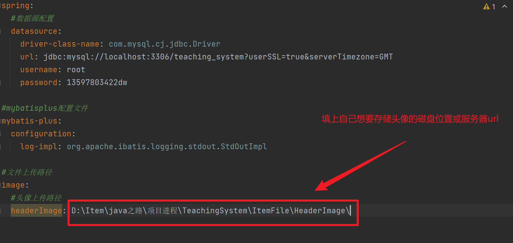

~~(2)前端配置较为繁琐，需要将 student、teacher、admin 模块中的 public.vue 文件 el-avatar 标签中的 src 中的路径更改为项目相对路径或服务器 url
地址~~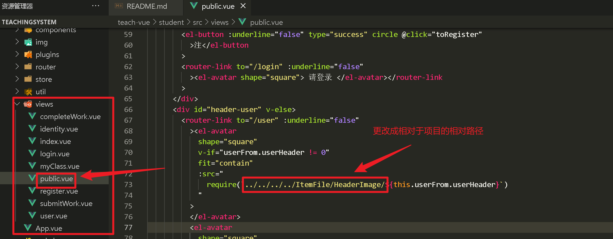

**2022.5.19更新已修复此bug**

## 2.项目已知 bug 及项目注意事项

(1)前端头像及用户信息更改时需要用户重新登录

(2)后端打包时需要先将 public 模块进行 install 操作，而后对其他模块进行 package 操作

(3)后端文件服务器上传时延迟较长(根据电脑配置而定)

## 3.关于此项目引用版权问题

(1)学生端、教师端、管理端登录背景视频素材均来自

[Free Stock Video Footage, Royalty Free Videos for Download (coverr.co)](https://coverr.co/)

(2)图片资源均来自百度图片

## 4.总结

这个项目是我迄今为止做的最大、最精、最完美的项目，前后共 27 天，全程由个人独立开发。这也是大学最后一个项目，后期将只维护不开发。项目已发布到 Gitee 和 GitHub 上，感兴趣的同学可以自行拿取，其他用途只需注明作者即可。

项目 Gitee 地址：[梦途/Item (gitee.com)](https://gitee.com/cfnjs20020602/item)

项目 GitHub 地址：[2516649281/Item (github.com)](https://github.com/2516649281/Item)

# 九、更新日志(实时更新)

2022/5/6 修复了用户登录时账号已注销但仍能登录的 bug，后端异常处理类由 if-else 更改为 switch 型，利用反射抹除了大量赘余代码，后端新增 javadoc 开发文档。

2022/5/13 修复了用户登录后业务无法执行的 bug，public 模块新增 redis 业务，后台 token 从此由 redis 接管。

2022/5/19 修复了用户头像上传的 bug，新增文件服务器，文件由一个单独的项目管理，新增集群管理器 nacos，各模块逐渐向分布式发展

2022/6/22 将redis真正的加入项目中，mysql数据库压力大大减少

2022/6/23 新增数据库文档和api接口文档，前端代码和后端代码优化

2022/6/26 项目第一次试发布，预计运行一个月，仅学生端开放，演示地址:[teaching-student](http://47.97.229.224:8000/#/index)

2022/6/27 修复了若干bug，管理端新增文件管理模块，前后端代码优化

2022/7/1 修复管理端当班级存在学生时能直接删除的bug，后端缓存系统优化，管理员查看学生和教师信息更加详细和快速

2022/7/3 前后端代码优化，新增批量删除功能
