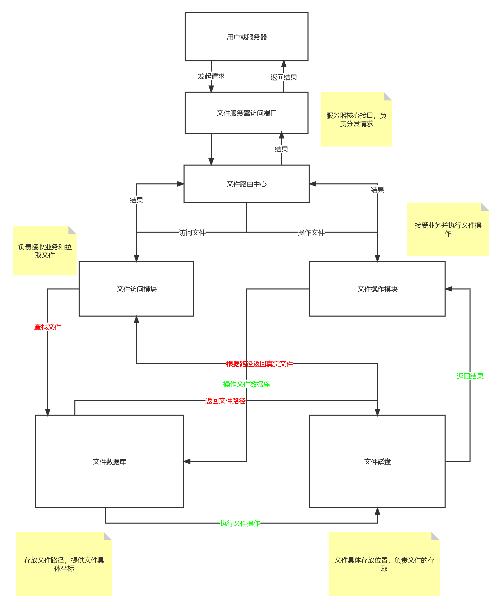
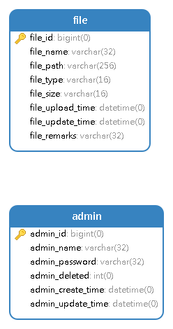

# 文件上传系统设计

# 一、开发背景

在先前制作的项目中，视频、头像等动态的影像资源都直接存放在本地文件夹下，vue前端生产和开发阶段，大量静态资源无法统一管理，导致vue在打包时空间占用过于庞大(**误将动态资源当作静态资源打包**)


**为了更加高效的管理整个系统的文件，也为了后续更好的添加新功能**(后续可能会添加以文件形式的作业上传功能)

为此，制作此系统，以维护教务管理系统(升级版)的文件

> 项目动态的文件维护极其不便
>
> 

# 二、需求分析

## 1.执行流程



## 2.业务分析

**管理员(负责维护整个服务器的运行)**:管理员id，管理员账号，管理员密码，逻辑删除，创建时间，修改时间

**文件**:文件id，文件名称，文件绝对路径，文件类型，大小，上传时间，修改时间，备注

## 3.技术栈

### (1)后端

SpringBoot+MyBatisPlus+Redis+SpringMVC

### (2)前端

Vue+ElementUI+Axios

### (3)数据库

MySQL8.0+

redis6.0.6

### (4)开发环境

JDK 1.8

# 三、数据层

## 1.数据库结构



## 2.脚本

```sql
create database FileServer;

use FileServer;

-- 管理员表
create table admin
(
    admin_id          bigint primary key auto_increment comment '管理员编号',
    admin_name        varchar(32) not null comment '管理员账号',
    admin_pass        varchar(32) not null comment '管理员密码',
    admin_deleted     int         not null default 0 comment '逻辑删除(0代表正常,1代表删除)',
    admin_create_time datetime    not null default CURRENT_TIMESTAMP comment '创建时间',
    admin_update_time datetime    not null default CURRENT_TIMESTAMP comment '修改时间'
);

-- 文件表
create table file
(
    file_id          bigint primary key auto_increment comment '文件编号',
    file_name        varchar(32)  not null comment '文件名',
    file_path        varchar(256) not null comment '文件路径',
    file_type        varchar(16)  not null comment '文件类型',
    file_size        varchar(16)  not null comment '文件大小',
    file_upload_time datetime     not null default CURRENT_TIMESTAMP comment '上传时间',
    file_update_time datetime     not null default CURRENT_TIMESTAMP comment '修改时间',
    file_Remarks     varchar(32) comment '备注'
);
```

# 四、后端业务开发

## 1.持久层

### (1)文件实体类

```java
/**
 * 文件表
 */
@Data
@AllArgsConstructor
@NoArgsConstructor
@TableName("file")
public class FileSource {
    @TableId
    private Long fileId;//文件编号
    private final String fileName;//文件名称
    private final String filePath;//文件路径
    private final String fileType;//文件类型
    private final String fileSize;//文件大小
    private final String fileUploadTime;//文件上传时间
    private String fileUpdateTime;//文件修改时间

    public FileSource(String fileName, String filePath, String fileType, String fileSize, String fileUploadTime, String fileUpdateTime) {
        this.fileName = fileName;
        this.filePath = filePath;
        this.fileType = fileType;
        this.fileSize = fileSize;
        this.fileUploadTime = fileUploadTime;
        this.fileUpdateTime = fileUpdateTime;
    }


    public FileSource(Long fileId, String fileName, String filePath, String fileType, String fileSize, String fileUploadTime) {
        this.fileId = fileId;
        this.fileName = fileName;
        this.filePath = filePath;
        this.fileType = fileType;
        this.fileSize = fileSize;
        this.fileUploadTime = fileUploadTime;
    }
}
```

### (2)**管理员实体类**

```java
/**
 * 管理员表
 */
@Data
@AllArgsConstructor
@NoArgsConstructor
@TableName("admin")
public class Admin {
    @TableId
    private Long adminId;//管理员编号
    private String adminName;//管理员账号
    private String adminPassword;//管理员密码
    private Integer adminDeleted;//逻辑删除
    private Date adminCreateTime;//创建时间
    private Date adminUpdateTime;//修改时间
}
```

## 2.业务层

### (1)业务层核心

#### 文件业务层实现类

```java
/**
 * 文件业务层
 */
@Service
@Transactional
public class FileServiceImpl extends ServiceImpl<FileMapper, FileSource> implements IFileService {

    /**
     * 服务器文件存放路径
     */
    @Value("${filePath}")
    private String filePath;

    /**
     * 文件持久层
     */
    @Autowired(required = false)
    private FileMapper fileMapper;


    /**
     * 一次上传一个文件
     *
     * @param fileByte    文件字节数组
     * @param fileSize    文件大小
     * @param oldFileName 文件名
     * @return 上传是否成功
     */
    @Override
    public JsonRequest<Map<Long, Integer>> loadFile(byte[] fileByte, Integer fileSize, String oldFileName) {
        Map<Long, Integer> map = new HashMap<>();
        String[] types = oldFileName.split("\\.");
        String fileType = types[types.length - 1];//截取文件最后一位以.分割的字符串,必定是后缀名
        String fileName = getFileName(fileType);//生成文件名
        List<FileSource> loadFileSources = fileMapper.selectList(new QueryWrapper<FileSource>().eq("file_name", fileName));
        //判断文件是否存在
        if (loadFileSources.size() > 0) {
            throw new FileLoadIsExistException("文件已存在");
        }
        try {
            //上传文件
            runLoadFile(fileByte, fileSize, fileName);
        } catch (Exception e) {
            throw new FileLoadErrorException("文件上传失败");
        }
        FileSource source = new FileSource(fileName, filePath + fileName, fileType, fileSize + "K", new SimpleDateFormat(dateFormat).format(new Date()), new SimpleDateFormat(dateFormat).format(new Date()));
        //将数据保存到数据库中
        int column = fileMapper.insert(source);
        if (column < 1) {
            throw new FileLoadErrorException("文件上传失败");
        }
        map.put(source.getFileId(), column);
        return new JsonRequest<>( map, "文件上传成功");
    }

    /**
     * 一次上传多个文件
     *
     * @param bytes    文件字节数组
     * @param fileSize 文件大小
     * @param fileName 文件名
     * @return 上传是否成功
     */
    @Override
    public JsonRequest<Map<Long, Integer>> loadFiles(List<byte[]> bytes, Integer[] fileSize, String[] fileName) {
        Map<Long, Integer> loadFile = new HashMap<>();
        int column = 0;
        for (int i = 0; i < bytes.size(); i++) {
            //多次调用
            JsonRequest<Map<Long, Integer>> request = loadFile(bytes.get(i), fileSize[i], fileName[i]);
            if (request.getData() != null) {
                //合并集合元素
                loadFile.putAll(request.getData());
            }
        }
        //计算影响行数
        for (Integer value : loadFile.values()) {
            column += value;
        }
        return new JsonRequest<>( loadFile, column + "个文件上传成功");
    }

    /**
     * 修改一个文件
     *
     * @param bytes       文件字节数组
     * @param fileSize    文件大小
     * @param oldFileName 文件名
     * @param fileId      原始文件的数据库编号
     * @return 修改是否成功
     */
    @Override
    public JsonRequest<Integer> updateFile(byte[] bytes, Integer fileSize, String oldFileName, Long fileId) {
        String[] types = oldFileName.split("\\.");
        String fileType = types[types.length - 1];//截取文件最后一位以.分割的字符串,必定是后缀名
        String fileName = getFileName(fileType);//生成文件名
        try {
            //上传新文件
            runLoadFile(bytes, fileSize, fileName);
        } catch (Exception e) {
            throw new FileLoadErrorException("文件上传失败");
        }
        //获取原文件
        File file = new File(fileMapper.selectById(fileId).getFilePath());
        if (file.exists()) {
            //删除源文件
            if (!file.delete()) {
                throw new FileDeleteErrorException("重置文件失败!");
            }
        }
        int column = fileMapper.updateById(new FileSource(fileId, fileName, filePath + fileName, fileType, fileSize + "K", new SimpleDateFormat(dateFormat).format(new Date())));
        if (column < 1) {
            throw new FileDeleteErrorException("修改文件失败!");
        }
        return new JsonRequest<>( column, "文件修改成功!");
    }

    /**
     * 一次修改多个文件
     *
     * @param bytes       文件字节数组
     * @param fileSize    文件大小
     * @param oldFileName 文件名
     * @param fileId      文件原始编号
     * @return 修改是否成功
     */
    @Override
    public JsonRequest<Integer> updateFiles(List<byte[]> bytes, Integer[] fileSize, String[] oldFileName, Long[] fileId) {
        Integer column = 0;
        for (int i = 0; i < bytes.size(); i++) {
            //循环调用
            JsonRequest<Integer> jsonRequest = updateFile(bytes.get(i), fileSize[i], oldFileName[i], fileId[i]);
            column += jsonRequest.getData();
        }
        return new JsonRequest<>( column, column + "个文件修改完成");
    }

    /**
     * 删除一个文件
     *
     * @param fileId 数据库编号
     * @return 删除是否成功
     */
    @Override
    public JsonRequest<Integer> deleteFile(Long fileId) {
        //获取文件
        FileSource fileSource = fileMapper.selectById(fileId);
        if (fileSource == null) {
            throw new FileDeleteIsNullException("文件不存在!");
        }
        File file = new File(fileSource.getFilePath());
        if (file.exists()) {
            if (!file.delete()) {
                throw new FileDeleteErrorException("文件删除失败!");
            }
        }
        int column = fileMapper.deleteById(fileId);
        if (column < 1) {
            throw new FileDeleteErrorException("文件删除失败!");
        }
        return new JsonRequest<>( column, "删除成功!");
    }

    /**
     * 一次删除多个文件
     *
     * @param fileIds 数据库中文件编号
     * @return 删除是否成功
     */
    @Override
    public JsonRequest<Integer> deleteFiles(Long[] fileIds) {
        int column = 0;
        for (Long fileId : fileIds) {
            //循环调用
            JsonRequest<Integer> jsonRequest = deleteFile(fileId);
            column += jsonRequest.getData();
        }
        return new JsonRequest<>( column, column + "个文件已删除!");
    }

    /**
     * 读取一个文件
     *
     * @param fileId 文件编号
     * @return 文件实体
     */
    @Override
    public ResponseEntity<FileSystemResource> selectFile(Long fileId) {
        //获取文件路径
        FileSource fileSource = fileMapper.selectById(fileId);
        if (fileSource == null) {
            throw new FileDeleteErrorException("读取失败!");
        }
        File file = new File(fileSource.getFilePath());
        HttpHeaders headers = new HttpHeaders();
        headers.add("Cache-Control", "no-cache, no-store, must-revalidate");
        headers.add("Content-Disposition", "attachment; filename=" + file.getName());
        headers.add("Pragma", "no-cache");
        headers.add("Expires", "0");
        headers.add("Last-Modified", new Date().toString());
        headers.add("ETag", String.valueOf(System.currentTimeMillis()));
        return ResponseEntity
                .ok()
                .headers(headers)
                .contentLength(file.length())
                .contentType(MediaType.parseMediaType("application/octet-stream"))
                .body(new FileSystemResource(file));
    }

    /**
     * 读取多个文件
     *
     * @param fileIds 文件编号
     * @return 文件集合
     */
    @Override
    public List<ResponseEntity<FileSystemResource>> selectFiles(Long[] fileIds) {
        List<ResponseEntity<FileSystemResource>> files = new ArrayList<>();
        for (Long fileId : fileIds) {
            ResponseEntity<FileSystemResource> entity = selectFile(fileId);
            files.add(entity);
        }
        return files;
    }


    /**
     * 随机生成文件名称
     *
     * @param fileType 文件类型
     * @return 名称
     */
    public String getFileName(String fileType) {
        if (fileType == null || fileType.equals("")) {
            throw new FileLoadIsNullException("文件不得为空!");
        }
        return UUID.randomUUID().toString().toUpperCase() + "." + fileType;
    }

    /**
     * 将字节流转换成文件再上传到指定目录
     *
     * @param multipartFile 文件字节流
     * @param fileSize      文件大小
     * @param fileName      文件名称
     */
    public void runLoadFile(byte[] multipartFile, Integer fileSize, String fileName) {
        ByteArrayInputStream inputStream = null;
        BufferedOutputStream outputStream = null;
        try {
            //将字节数组转换成字节流
            inputStream = new ByteArrayInputStream(multipartFile);
            //创建输出流，并读取
            outputStream = new BufferedOutputStream(new FileOutputStream(filePath + fileName));
            byte[] b = new byte[fileSize];
            //写文件
            while (inputStream.read(b) != -1) {
                outputStream.write(b);
            }
        } catch (Exception e) {
            e.printStackTrace();
        }
        //释放资源
        try {
            if (inputStream != null) {
                inputStream.close();
            }
            if (outputStream != null) {
                outputStream.close();
            }
        } catch (Exception e) {
            e.printStackTrace();
        }

    }
}
```

#### 管理端业务层实现类

```java
/**
 * 管理员业务层
 */
@Service
@Transactional
public class AdminServiceImpl extends ServiceImpl<AdminMapper, Admin> implements IAdminService {
	//TODO 构思中
}
```

### (2)异常处理系统

#### 全局捕获异常核心代码

```java
/**
 * 控制层超类
 */
@Controller
public class ServiceController {

    /**
     * 全局异常捕获
     *
     * @param e 异常
     * @return JSON
     */
    @ExceptionHandler
    public JsonRequest<Void> getException(Exception e) {
        JsonRequest<Void> jsonRequest = new JsonRequest<>();
        Class<? extends Exception> aClass = e.getClass();
        String name = aClass.getSimpleName();
        switch (name) {
            //////////////////////管理员异常//////////////////////
            case "AdminSelectErrorException"://查询失败
                jsonRequest.setStatue(101);
                break;
            case "AdminSelectIsNullException"://查询结果为空
                jsonRequest.setStatue(102);
                break;
            case "AdminInsertErrorException"://添加失败
                jsonRequest.setStatue(201);
                break;
            case "AdminInsertIsExistException"://添加的数据已存在
                jsonRequest.setStatue(202);
                break;
            case "AdminInsertIsNullException"://添加时请求数据为空
                jsonRequest.setStatue(203);
                break;
            case "AdminUpdateErrorException"://修改失败
                jsonRequest.setStatue(301);
                break;
            case "AdminUpdateIsNullException"://修改的数据为空
                jsonRequest.setStatue(302);
                break;
            case "AdminDeleteErrorException":
                jsonRequest.setStatue(401);//删除失败
                break;
            case "AdminDeleteIsNullException":
                jsonRequest.setStatue(402);//删除的数据为空
                break;
            //////////////////////文件异常//////////////////////
            case "FileDeleteErrorException"://删除失败
                jsonRequest.setStatue(601);
                break;
            case "FileDeleteIsNullException"://删除的文件为空
                jsonRequest.setStatue(602);
                break;
            case "FileLoadErrorException"://上传失败
                jsonRequest.setStatue(701);
                break;
            case "FileLoadIsExistException"://上传的文件已存在
                jsonRequest.setStatue(702);
                break;
            case "FileLoadIsnullException"://上传文件请求的参数为空
                jsonRequest.setStatue(703);
                break;
            case "FileLookErrorException"://文件查看失败
                jsonRequest.setStatue(801);
                break;
            case "FileLookIsNullException"://查看的文件为空
                jsonRequest.setStatue(802);
                break;
            case "FileUpdateErrorException"://修改文件失败
                jsonRequest.setStatue(901);
                break;
            case "FileUpdateIsNullException"://修改的文件为空
                jsonRequest.setStatue(902);
                break;
            //////////////////////未知异常//////////////////////
            case "AdminSelectException":
                jsonRequest.setStatue(100);//管理员查询异常
                break;
            case "AdminInsertException":
                jsonRequest.setStatue(200);//管理员添加异常
                break;
            case "AdminUpdateException":
                jsonRequest.setStatue(300);//管理员修改异常
                break;
            case "AdminDeleteException":
                jsonRequest.setStatue(400);//管理员删除异常
                break;
            case "FileDeleteException":
                jsonRequest.setStatue(600);//文件删除异常
                break;
            case "FileLoadException":
                jsonRequest.setStatue(700);//文件上传异常
                break;
            case "FileLookException":
                jsonRequest.setStatue(800);//文件查看异常
                break;
            case "FileUpdateException":
                jsonRequest.setStatue(900);//文件修改异常
                break;
            case "FileException"://文件异常
                jsonRequest.setStatue(1000);
                break;
            case "AdminException"://管理员异常
                jsonRequest.setStatue(1100);
                break;
            case "ServiceException"://业务层异常
                jsonRequest.setStatue(1200);
                break;
            default:
                jsonRequest.setStatue(500);//未知异常
        }
        jsonRequest.setMessage(e.getMessage());
        return jsonRequest;
    }
```

> 以上异常均为自定义异常

## 3.表现层

### (1)文件操作

```java
/**
 * 文件操作controller
 */
@RestController
@RequestMapping("/file")
public class FileController extends ServiceController {

    /**
     * 文件业务层
     */
    @Autowired(required = false)
    private IFileService fileService;

    /**
     * 一次上传一个文件
     *
     * @param bytes    文件字节数组
     * @param fileSize 文件大小
     * @param fileName 文件名
     * @return 上传是否成功
     */
    @PostMapping("/load")
    public JsonRequest<Map<Long, Integer>> loadFile(@RequestBody byte[] bytes, @RequestParam("fileSize") Integer fileSize, @RequestParam("fileName") String fileName) {
        return fileService.loadFile(bytes, fileSize, fileName);
    }


    /**
     * 一次上传多个文件
     *
     * @param bytes    文件字节数组
     * @param fileSize 文件大小
     * @param fileName 文件名
     * @return 上传是否成功
     */
    @PostMapping("/loads")
    public JsonRequest<Map<Long, Integer>> loadFiles(@RequestBody List<byte[]> bytes, @RequestParam("fileSize") Integer[] fileSize, @RequestParam("fileName") String[] fileName) {
        return fileService.loadFiles(bytes, fileSize, fileName);
    }

    /**
     * 修改一个文件
     *
     * @param bytes    文件字节数组
     * @param fileSize 文件大小
     * @param fileName 文件名
     * @param fileId   原始文件的数据库编号
     * @return 修改是否成功
     */
    @PutMapping("/update/{fileId}")
    public JsonRequest<Integer> updateFile(@RequestBody byte[] bytes, @RequestParam("fileSize") Integer fileSize, @RequestParam("fileName") String fileName, @PathVariable Long fileId) {
        return fileService.updateFile(bytes, fileSize, fileName, fileId);
    }

    /**
     * 一次修改多个文件
     *
     * @param bytes    文件字节数组
     * @param fileSize 文件大小
     * @param fileName 文件名
     * @param fileId   文件原始编号
     * @return 修改是否成功
     */
    @PutMapping("/updates")
    public JsonRequest<Integer> updateFiles(@RequestBody List<byte[]> bytes, @RequestParam("fileSize") Integer[] fileSize, @RequestParam("fileName") String[] fileName, @RequestParam Long[] fileId) {
        return fileService.updateFiles(bytes, fileSize, fileName, fileId);
    }

    /**
     * 删除一个文件
     *
     * @param fileId 数据库编号
     * @return 删除是否成功
     */
    @DeleteMapping("/delete/{fileId}")
    public JsonRequest<Integer> deleteFile(@PathVariable Long fileId) {
        return fileService.deleteFile(fileId);
    }

    /**
     * 一次删除多个文件
     *
     * @param fileIds 数据库中文件编号
     * @return 删除是否成功
     */
    @DeleteMapping("/deletes")
    public JsonRequest<Integer> deleteFiles(@RequestBody Long[] fileIds) {
        return fileService.deleteFiles(fileIds);
    }

    /**
     * 读取一个文件
     *
     * @param fileId 文件编号
     * @return 文件实体
     */
    @GetMapping("/select/{fileId}")
    public ResponseEntity<FileSystemResource> selectFile(@PathVariable Long fileId) {
        return fileService.selectFile(fileId);
    }

    /**
     * 读取多个文件
     *
     * @param fileIds 文件编号
     * @return 文件集合
     */
    @GetMapping("/selects")
    public List<ResponseEntity<FileSystemResource>> selectFiles(@RequestBody Long[] fileIds) {
        return fileService.selectFiles(fileIds);
    }
}
```

### (2)管理员操作

```java
/**
 * 管理员控制层
 */
@RestController
@RequestMapping("/admin")
public class AdminController extends ServiceController {
    // TODO 构思中
}
```

# 五、前端管理层开发

开发中...

# 六、已知的部分bug及临时解决方案

1.单次图片上传时大小不能超过**long型变量**的最大范围，即2^63-1k

2.文件上传时耗费的时间可能无规律(取决于电脑配置)
